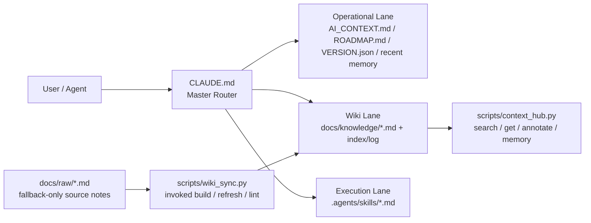

# 🍲 O-ALL-WANT (OAW) Framework

[English](README.en.md) | [中文](README.md)

> Why choose when you can have it all?

<p align="center">
  
</p>

## Why are you here?

This is a harness for unapologetically greedy agentic coders.

If you bounce between AI coding platforms, obsess over token efficiency, and have zero patience for goldfish-brain agents, this repo is for you. If you are tired of agents forgetting the project every session, re-reading the whole codebase, and burning through an expensive context window before you even reach the real task, OAW is meant to be the armor layer between you and that chaos.

This project came out of several late nights spent pushing Claude Code and Codex far past reasonable working hours, then remixing ideas from self-improving harnesses, Context Hub, MemPalace, Karpathy-style LLM Wiki workflows, and Garry Tan's thin harness / fat skills framing into one deliberately overloaded setup.

The goal is simple: every expensive token should go toward real reasoning and useful output, not toward replaying finished work or re-explaining your project structure from scratch.

**Only want one piece of this?** Fork the original project that does that one thing best (listed below in Source Lineage). This repo is for people who want the whole hot pot.

## 🍲 What's in the hot pot?

- 🔄 **Self-improving logic** — `VERSION.json`, `ROADMAP.md`, and `do_not_rerun` give the agent a sense of progress so it does not spin in circles or rerun finished work. This comes from the broader family of self-managing harness patterns.
- 📉 **Token optimizer (Context Hub + RTK-inspired output trimming)** — `CLAUDE.md` routes by lane and only loads the context that matters, while `context_hub.py` handles search, annotate, and memory operations; `--compact` carries the extra idea that the output should be shortened too when full prose is unnecessary. The core inspiration is Andrew Ng's Context Hub plus the RTK-style idea of output-side token reduction.
- ⚡ **thin harness / fat skills (Garry Tan)** — repeated workflows live in `.agents/skills/*.md`, not in one giant prompt blob. OAW keeps that spirit, then layers routing on top.
- 🧠 **Memory Palace** — the agent gets durable cross-session memory instead of snapping back to zero every conversation. OAW uses `.agents/memory.md` and structured wrap-up discipline to support that.
- 📚 **Auto-evolving LLM Wiki (Karpathy concept)** — raw notes in `docs/raw/` can be compiled into durable knowledge pages in `docs/knowledge/`, so the agent is not just reading notes; it is learning to organize them.

This list is not closed. If we keep finding genuinely useful ideas that fit OAW cleanly, we will keep folding them in.

### 🤝 Optional companion: RTK (Rust Token Killer)

RTK is the shell-output compression tool from [rtk-ai/rtk](https://github.com/rtk-ai/rtk). OAW decides **what** the agent should read; RTK focuses on **how much** noisy terminal output comes back. Different layers, conceptually complementary.

It is not an OAW dependency, and OAW does not install it for you. What OAW actually absorbed is the RTK-style idea that token savings are not only about routing input context, but also about trimming output when a compact answer is enough. In OAW, that idea mainly shows up in the built-in `--compact` modes. So the concept made it in; the RTK binary did not.

If all you want is OAW's built-in token-friendly summary mode, you do **not** need RTK. Just use:

```bash
python3 scripts/context_hub.py status --compact
python3 scripts/context_hub.py search "keyword" --compact
python3 scripts/context_hub.py bootstrap --compact
```

If you want RTK itself, follow the RTK upstream README and releases directly. OAW does not install or manage RTK for you.

## Architecture in one page

`CLAUDE.md` chooses the right lane first, then skills and scripts take over the repetitive work. The point is to avoid shoving the entire repo into context on every turn.



After install, you get these core pieces:

| File | Responsibility | Do you touch it? |
|------|---------------|-----------------|
| `CLAUDE.md` | Agent brain: decides what to read and which skill to dispatch | ✅ Fill `${LANGUAGE}` once at install |
| `AI_CONTEXT.md` | Project encyclopedia: architecture, stack, baselines | ✅ Fill once at install |
| `.agents/memory.md` | Short-term diary: decisions / bugs / findings | ❌ Agent writes it |
| `docs/knowledge/` | Long-term knowledge: curated pages the agent reads later | ❌ Agent compiles it from `docs/raw/` |
| `.agents/skills/*.md` | SOP library: dispatched by task type | Optional: add your own |
| `scripts/*.py` | Mechanical helpers: search, wiki compile, maintenance | ❌ Agent invokes them |

> 💡 **Memory vs Knowledge**: Memory is a diary (short-term events). Knowledge is a textbook (long-term reusable understanding). Once 3-5 related memory entries pile up, ask the agent to distill them into a wiki page.

## Quick Start

```bash
# Existing project: go into your repo
cd /path/to/your/project

# Brand-new project: init first
# mkdir my-project && cd my-project && git init

git clone https://github.com/lihowfun/O-ALL-WANT.git .agent-framework
bash .agent-framework/install.sh
```

Then paste this to your agent:

> Read `CLAUDE.md` first, then `AI_CONTEXT.md`.
> Replace `${LANGUAGE}` with my preferred language.
> Replace the placeholders in `AI_CONTEXT.md` with this project's real facts.
> Then scan my codebase and suggest which repeated workflows belong in `.agents/skills/`.

### 🔌 Adapting to different agents / IDEs

The router file is always `CLAUDE.md`, but different agents look for different startup files:

| Agent / IDE | Default file | OAW adapter |
|-------------|-------------|-------------|
| **Claude Code** | `CLAUDE.md` | ✅ Works out of the box |
| **GitHub Copilot** | `.github/copilot-instructions.md` | ✅ Auto-created by installer, points to `CLAUDE.md` |
| **OpenAI Codex** | `AGENTS.md` | One-line pointer: `Read CLAUDE.md for project rules.` |
| **Cursor** | `.cursorrules` | Same |
| **Windsurf** | `.windsurfrules` | Same |
| **Gemini** | `GEMINI.md` | Same |

If you do not want to think about it, just tell the agent: "read CLAUDE.md first."

## 🧭 You talk like a human, the agent does the routing

The core idea is simple: most of the time, you should just talk to your agent normally. As long as it reads `CLAUDE.md` and follows the Skills-First Principle, it should know what to load and what to run.

| You say to the agent... | It will usually... |
|-------------------------|--------------------|
| "I just decided to switch to Redis for caching" | Write to `.agents/memory.md` → `[DECISION] Switch to Redis` |
| "This bug is caused by an N+1 query" | Write to memory, then suggest wiki distillation if similar entries pile up |
| "Help me organize the notes in `docs/raw/`" | Match `/wiki-refresh` → run `wiki_sync.py refresh` → produce a knowledge page |
| "Run a benchmark" | Match `/benchmark` → read baselines → execute → generate a report |
| "Prepare release v1.2.0" | Match `/version-release` → run the full checklist |
| "This is broken, help me debug" | Match `/debug-pipeline` → diagnose layer by layer → record the root cause |
| "What's the current project status?" | Run `context_hub.py status` → show version, recent decisions, and knowledge topics |

Details: [Skill Guide](docs/Skill_Guide.md).

### Want to run commands yourself?

If you prefer driving the tools manually instead of asking the agent to dispatch them, these are the main ones:

| Command | Purpose |
|---------|---------|
| `python3 scripts/context_hub.py status` | Version + recent decisions + knowledge topics |
| `python3 scripts/context_hub.py search "keyword"` | Search the knowledge base |
| `python3 scripts/context_hub.py memory add "[TAG] content"` | Manually write to memory |
| `python3 scripts/wiki_sync.py refresh topic_name` | Compile one wiki topic |
| `python3 scripts/wiki_sync.py lint` | Check metadata consistency |
| `python3 scripts/wiki_sync.py lint --strict` | Also flag unfilled `${...}` / `YYYY-MM-DD` markers |

Full list: [CLI Reference](docs/CLI_Reference.md).

## 🐕 Self-hosting: the repo is its own first user

The root `CLAUDE.md`, `AI_CONTEXT.md`, and related files are the **OAW team's own** working copies, not the generic template you install. Your installable version lives in `templates/`, and `install.sh` copies it into your project.

**Public memory policy**: `.agents/memory.md` is gitignored because memory is a local diary. The public artifact is distilled knowledge in `docs/knowledge/`.

## Source Lineage (standing on the shoulders of giants)

OAW does not copy source code from these projects or ideas directly, but its design is heavily shaped by them:

- 🔄 **Self-improving harness patterns** — version / roadmap / do_not_rerun discipline so agents understand progress and avoid rerunning finished work
- 📉 **[andrewyng/context-hub](https://github.com/andrewyng/context-hub)** (MIT) — searchable knowledge, annotations, and routing
- ⚡ **[thin harness / fat skills (Garry Tan)](https://x.com/garrytan/status/2042925773300908103)** — keep the router light, push repeated work into skills
- 🧠 **[Memory Palace / MemPalace](https://github.com/MemPalace/mempalace)** (MIT) — mid-task amnesia, structured wrap-up, and durable memory ideas
- 📚 **[Karpathy-style LLM Wiki](https://gist.github.com/karpathy/442a6bf555914893e9891c11519de94f)** — separate raw notes from compiled knowledge
- 🤝 **[RTK (rtk-ai/rtk)](https://github.com/rtk-ai/rtk)** — concept-level inspiration for output-side token reduction; OAW does not bundle RTK, but `--compact` follows the same "shorten what comes back" philosophy

This list will keep evolving too. When we find something that is genuinely useful and fits OAW cleanly, we will add it.

Deeper reading: [Architecture Origins](docs/Architecture_Origins.md) · [Design Principles](docs/Design_Principles.md)

## Examples + Docs

- Examples: [`example/`](example/) (start with `minimal-project/`)
- [CLI Reference](docs/CLI_Reference.md) · [Skill Guide](docs/Skill_Guide.md) · [Wiki Sync Guide](docs/Wiki_Sync_Guide.md)
- [CONTRIBUTING.md](CONTRIBUTING.md) · [CHANGELOG.md](CHANGELOG.md)

## License

MIT
