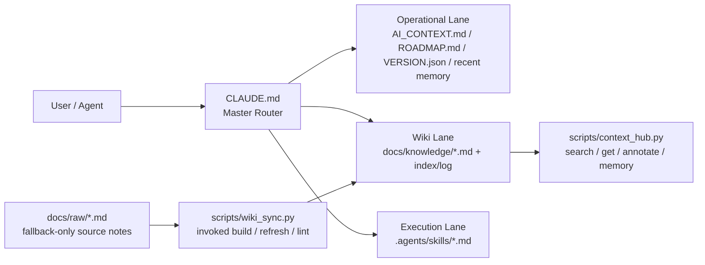

# 🍲 O-ALL-WANT (OAW) Framework

[English](README.en.md) | [中文](README.md)

> Why choose when you can have it all?

<p align="center">
  
</p>

This is an AI Harness hodgepodge designed specifically for "greedy" developers. We want AI not only to write code for us, but also to maintain cross-session memory, save tokens, and ideally compile scattered knowledge into an evolving Wiki—just like Andrej Karpathy suggested.

This project is the culmination of several late nights bossing around Claude Code and Codex, integrating some of the most popular Harness repositories, Memory Palace concepts, and Token optimization logic into one cohesive framework.

So what I want is actually very simple:

- It must write code.
- It must not lose memory across sessions.
- It must save tokens—do not read the entire repo every time.
- It must slowly compile scattered notes into a reusable knowledge wiki.
- It must capture repeated workflows into skills and scripts, instead of restating them every time.

If you only need a single feature, please directly Fork the original author's repository (don't waste your time here). But if you are like me and want it all, here you go:

## 🛠 Hodgepodge Inventory

- 🧠 **Memory Palace**: Gives your Agent persistent memory, so it doesn't forget mid-conversation.
  The core of this layer lands in `.agents/memory.md` and a structured wrap-up discipline.
- 📉 **Token Optimizer**: Spends every token where it counts through precise Context routing.
  The core approach is using `CLAUDE.md` as the master router, reading by lane lazily.
- 📚 **LLM Wiki (Karpathy Concept)**: Automates the knowledge compilation process, so AI helps you organize a textbook instead of flipping through random PDFs every time.
  The core combination is `docs/raw/`, `docs/knowledge/`, and `scripts/wiki_sync.py`.
- ⚡ **Agentic Workflows**: Pre-configured Markdown-driven SOPs, so high-frequency tasks don't need to be explained repeatedly.
  This layer primarily lands in `.agents/skills/*.md` and helper scripts.

## Architecture Diagram

`CLAUDE.md` decides which lane a task should take; it only reads wikis, skills, or raw notes when strictly necessary, preventing the entire repo and all rules from being shoved into context right away.



## Why won't this become a mess?

Because it doesn't force all rules into the same prompt — it separates responsibilities:

| Layer | Responsibility | File |
|-------|---------------|------|
| **Router** | Decides what to read, which skill to dispatch | `CLAUDE.md` |
| **Context** | Project facts & architecture | `AI_CONTEXT.md` |
| **Skills** | Repeatable workflows (like function calls) | `.agents/skills/` |
| **Knowledge** | Curated long-term knowledge (saves tokens) | `docs/knowledge/` |
| **Memory** | Short-term event diary (decisions, bugs) | `.agents/memory.md` |
| **Scripts** | Mechanical maintenance (search, compile wiki) | `scripts/` |

A modularized "I want it all" — not all rules piled into one blob.

### How does knowledge grow automatically?

Drop your messy notes (meeting minutes, tech drafts, bug analyses) into `docs/raw/`,
then tell the Agent "help me organize api_notes into a knowledge page" —
in an agent environment that follows this router, it should prefer the `/wiki-refresh`
skill and compile it into a curated page in `docs/knowledge/`.
From then on, the Agent reads the curated version — saving tokens and staying precise.

> 💡 **Memory vs Knowledge**: Memory is a diary (short-term events), Knowledge is a textbook (long-term knowledge).
> When 3–5 similar memory entries accumulate, tell the Agent "distill these into a wiki page."

## Quick Start

### Plan A: Add Harness to an Existing Project

```bash
cd /path/to/your/project
git clone https://github.com/lihowfun/O-ALL-WANT.git .agent-framework
bash .agent-framework/install.sh
```

After installation, give your Agent this prompt:

> Read `CLAUDE.md` first, then `AI_CONTEXT.md`. Based on my project's language and architecture, customize these two files — keep whatever already exists, and add only the OAW-specific parts: routing rules, memory format, and skill triggers.

### Plan B: Start a New Project with Harness

```bash
mkdir my-project && cd my-project
git init
git clone https://github.com/lihowfun/O-ALL-WANT.git .agent-framework
bash .agent-framework/install.sh
```

After installation, give your Agent this prompt:

> Read `CLAUDE.md` first, then `AI_CONTEXT.md`. The project I'm building is [describe your project]. Customize the harness for this project: fill in AI_CONTEXT.md, set up ROADMAP.md milestones, and tune CLAUDE.md routing rules.

### 🔌 Adapting for Different Agents / IDEs

The installed router file is named `CLAUDE.md`, but different Agent platforms look for their own convention files at startup:

| Agent / IDE | Default file | OAW adapter |
|-------------|-------------|-------------|
| **Claude Code** | `CLAUDE.md` | ✅ Works out of the box |
| **GitHub Copilot** | `.github/copilot-instructions.md` | ✅ Auto-created by installer, points to `CLAUDE.md` |
| **OpenAI Codex** | `AGENTS.md` | Create `AGENTS.md` in project root: `Read CLAUDE.md for project rules.` |
| **Cursor** | `.cursorrules` | Create `.cursorrules` in project root: `Read CLAUDE.md for project rules.` |
| **Windsurf** | `.windsurfrules` | Create `.windsurfrules` in project root: `Read CLAUDE.md for project rules.` |
| **Gemini** | `GEMINI.md` | Create `GEMINI.md` in project root: `Read CLAUDE.md for project rules.` |

> 💡 **One router to rule them all**: No matter which Agent you use, the rules live in `CLAUDE.md`.
> Other files are just one-line pointers telling that Agent to read `CLAUDE.md`.
> If you prefer, simply tell your Agent "read CLAUDE.md first" — same effect.

## 🎁 Main Files You'll Get

```text
your-project/
├── CLAUDE.md              ← Agent's brain: decides what to read, which skill to dispatch
├── AI_CONTEXT.md          ← Project encyclopedia: Agent reads this to understand your project
├── VERSION.json           ← Version tracking + locks completed experiments (prevents reruns)
├── ROADMAP.md             ← Phase plan: Agent uses this to assess current progress
├── .agents/
│   ├── memory.md          ← Agent's diary: auto-records decisions, bugs, discoveries
│   └── skills/            ← Agent's SOP library: dispatched by task type
├── docs/
│   ├── knowledge/         ← Curated knowledge base: Agent reads here for context (saves tokens)
│   └── raw/               ← Your raw notes: Agent only reads these on demand
└── scripts/
    ├── context_hub.py     ← Knowledge management tool invoked by Agent
    └── wiki_sync.py       ← Notes → wiki compiler invoked by Agent
```

> 💡 **In three sentences**: `CLAUDE.md` is the Agent's brain, `AI_CONTEXT.md` is your project's encyclopedia,
> `.agents/memory.md` is the Agent's diary. Everything else — the Agent reads it when it needs to.

## 🧭 When To Use What?

> **Core principle: mostly just talk to your Agent.** If your Agent reads `CLAUDE.md`
> first and follows this router/skills setup, it will usually decide which files
> to read, which skill to invoke, and which script to run. You usually do not
> need to memorize commands.

### You speak naturally, the Agent will usually dispatch like this

| You say to Agent... | Agent will usually... |
|--------------------|----------------------|
| "I just decided to switch to Redis for caching" | Writes to `.agents/memory.md` → `[DECISION] Switch to Redis for caching` |
| "This bug is caused by an N+1 query" | Writes to `.agents/memory.md` → `[BUG] N+1 query...`; proactively proposes wiki distillation when similar entries accumulate |
| "Help me organize the notes in docs/raw/" | Matches the `/wiki-refresh` skill → runs `wiki_sync.py refresh` → outputs a curated `docs/knowledge/` page |
| "Run a benchmark" | Matches the `/benchmark` skill → reads baselines → executes → generates a comparison report |
| "Prepare release v1.2.0" | Matches the `/version-release` skill → runs the checklist → bumps version |
| "This thing is broken, help me debug" | Matches the `/debug-pipeline` skill → systematic layer-by-layer diagnosis → records the root cause |
| "What's the current project status?" | Runs `context_hub.py status` → shows version, recent decisions, knowledge topics |

### How does this work?

Every skill has `triggers` keywords (e.g., `["benchmark", "evaluate", "test scores"]`).
If your agent follows `CLAUDE.md`'s **Skills-First Principle**, it will usually match tasks like this:

```text
Your request → CLAUDE.md (master router) → match skill triggers → dispatch skill
                                         → skill internally calls scripts
                                         → results written to memory / knowledge
```

> 💡 **Your main job**: Set up `CLAUDE.md`, then talk to your Agent normally.
> Dispatching, recording, and knowledge management should mostly be handled by the router + skills + scripts.

### Advanced: Manual CLI Usage (Optional)

If you prefer to operate scripts directly:

| Command | Purpose |
|---------|---------|
| `python3 scripts/context_hub.py status` | View version, recent decisions, knowledge topics |
| `python3 scripts/context_hub.py search "keyword"` | Search the knowledge base |
| `python3 scripts/context_hub.py memory add "[TAG] content"` | Manually record to memory |
| `python3 scripts/wiki_sync.py refresh topic_name` | Manually compile a wiki topic |
| `python3 scripts/wiki_sync.py lint` | Check wiki metadata consistency |

## Inspirations / Source Lineage (Standing on the shoulders of giants)

The core philosophy of this framework merges concepts from the following excellent projects and ideas:

- 🧠 **[Memory Palace / MemPalace](https://github.com/MemPalace/mempalace)**: Fixes mid-task amnesia using structured wrap-ups
- 📉 **[andrewyng/context-hub](https://github.com/andrewyng/context-hub)**: Provides the basis for searchable knowledge, annotation, and session continuity
- 📚 **[Karpathy-style LLM Wiki](https://gist.github.com/karpathy/442a6bf555914893e9891c11519de94f)**: The concept of separating raw notes from actively compiled, durable wikis
- ⚡ **[Thin harness / fat skills (Garry Tan)](https://x.com/garrytan/status/2042925773300908103)**: The philosophy of encapsulating workflows in skills, keeping the router thin

If you want to see a more complete source comparison and integration rationale, please check:

- [Architecture Origins](docs/Architecture_Origins.md)
- [Design Principles](docs/Design_Principles.md)

## Examples + Docs

- Examples:
  - [Minimal Install Fixture](example/minimal-project/README.md): A snapshot of a minimal completed installation.
  - [Public Hybrid Demo](example/public-hybrid-demo/README.md): A public example featuring raw notes, compiled wikis, and skills.
- Docs:
  - [CLI Reference](docs/CLI_Reference.md)
  - [Skill Guide](docs/Skill_Guide.md)
  - [Wiki Sync Guide](docs/Wiki_Sync_Guide.md)
  - [Architecture Origins](docs/Architecture_Origins.md)
  - [Design Principles](docs/Design_Principles.md)

## 🐕 Self-Hosting: This Repo Is Its Own First User

You may notice `CLAUDE.md`, `AI_CONTEXT.md`, etc. at the repo root — these
are not templates for you; they are the **customized** versions the OAW team
uses to manage this repo with its own framework.

- Root `CLAUDE.md` = OAW development master router
- `templates/AGENT_RULES.md` = **the template you get after install** (this is for you)
- Skills and knowledge pages live in `templates/`

> 💡 This is eating our own dog food. If this framework works well enough
> to manage itself, it should work for your project too.

## License

MIT
