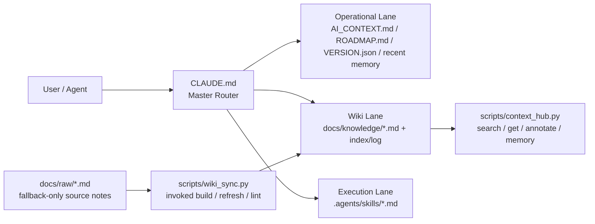

# 🍲 O-ALL-WANT (OAW) Framework

[English](README.en.md) | [中文](README.md)

> Why choose when you can have it all?

<p align="center">
  
</p>

## Why are you here?

This AI harness hodgepodge is for "greedy" developers. You want AI to write code, **and** you want it to:

- 🧠 **Not lose memory across sessions** — `.agents/memory.md` auto-logs decisions / bugs / findings
- 📉 **Not re-read the whole repo every turn** — `CLAUDE.md` routes by lane, lazy-read, saves tokens
- 📚 **Compile scattered notes into a reusable wiki** (Karpathy-style) — `docs/raw/` → `docs/knowledge/` via `scripts/wiki_sync.py`
- ⚡ **Capture repeated workflows as SOPs** — `.agents/skills/*.md`, no more restating

You want it all. So do I. This repo is the result of several late nights bossing around Claude Code and Codex, stitching together the most popular harness repos, memory palace concepts, and token-optimization tricks into one cohesive thing.

**Only want one of these?** Please fork the original author's repo (listed at the bottom in Source Lineage) — don't waste your time here.

### 🤝 Optional companion: RTK (Rust Token Killer)

OAW decides **what** to read; RTK compresses **how much** shell output comes back. Different layers, complementary.

```bash
brew install rtk && rtk init -g
```

## Architecture in one page

`CLAUDE.md` decides which lane a task takes; it only reads wikis, skills, or raw notes when strictly necessary.



What you get after install:

| File | Responsibility | Do you touch it? |
|------|---------------|-----------------|
| `CLAUDE.md` | Agent's brain: decides what to read, which skill to dispatch | ✅ Fill `${LANGUAGE}` once at install |
| `AI_CONTEXT.md` | Project encyclopedia: architecture, stack, baselines | ✅ Fill once at install |
| `.agents/memory.md` | Short-term diary: decisions / bugs / findings | ❌ Agent writes it |
| `docs/knowledge/` | Long-term knowledge: curated pages (agent reads here) | ❌ Agent compiles from `docs/raw/` |
| `.agents/skills/*.md` | SOP library: dispatched by task type | Optional: write your own |
| `scripts/*.py` | Mechanical maintenance: search, wiki compile | ❌ Agent invokes |

> 💡 **Memory vs Knowledge**: Memory is a diary (short-term events), Knowledge is a textbook (long-term). Once 3–5 similar memory entries accumulate, ask the agent to "distill these into a wiki page."

## Quick Start

```bash
# Existing project: go into your repo
cd /path/to/your/project

# Brand-new project: init first
# mkdir my-project && cd my-project && git init

git clone https://github.com/lihowfun/O-ALL-WANT.git .agent-framework
bash .agent-framework/install.sh
```

After install, paste this to your agent:

> Read `CLAUDE.md` first, then `AI_CONTEXT.md`.
> Replace `${LANGUAGE}` with my preferred language;
> replace the placeholders in `AI_CONTEXT.md` with this project's real facts.
> Then scan my codebase and suggest which repeated workflows belong in `.agents/skills/`.

### 🔌 Adapting for different agents / IDEs

The router file is always `CLAUDE.md`, but different agents look for different default rule files:

| Agent / IDE | Default file | OAW adapter |
|-------------|-------------|-------------|
| **Claude Code** | `CLAUDE.md` | ✅ Works out of the box |
| **GitHub Copilot** | `.github/copilot-instructions.md` | ✅ Auto-created by installer, points to `CLAUDE.md` |
| **OpenAI Codex** | `AGENTS.md` | One-line pointer: `Read CLAUDE.md for project rules.` |
| **Cursor** | `.cursorrules` | Same |
| **Windsurf** | `.windsurfrules` | Same |
| **Gemini** | `GEMINI.md` | Same |

If you can't be bothered, just tell the agent "read CLAUDE.md first" — same effect.

## 🧭 You speak naturally, the agent does the work

**Core principle**: mostly just talk to your agent. Assumes it reads `CLAUDE.md` and follows the Skills-First Principle.

| You say to Agent... | Agent will usually... |
|--------------------|----------------------|
| "I just decided to switch to Redis for caching" | Writes to `.agents/memory.md` → `[DECISION] Switch to Redis` |
| "This bug is caused by an N+1 query" | Writes to memory; suggests wiki distillation once similar entries accumulate |
| "Help me organize the notes in docs/raw/" | Matches the `/wiki-refresh` skill → runs `wiki_sync.py refresh` → outputs curated knowledge page |
| "Run a benchmark" | Matches `/benchmark` skill → reads baselines → executes → generates report |
| "Prepare release v1.2.0" | Matches `/version-release` skill → runs full checklist |
| "This is broken, help me debug" | Matches `/debug-pipeline` skill → layer-by-layer diagnosis → records root cause |
| "What's the current project status?" | Runs `context_hub.py status` → version + recent decisions + knowledge topics |

Deep dive: [Skill Guide](docs/Skill_Guide.md).

### Prefer to run commands yourself?

| Command | Purpose |
|---------|---------|
| `python3 scripts/context_hub.py status` | Version + recent decisions + knowledge topics |
| `python3 scripts/context_hub.py search "keyword"` | Search the knowledge base |
| `python3 scripts/context_hub.py memory add "[TAG] content"` | Manually write to memory |
| `python3 scripts/wiki_sync.py refresh topic_name` | Compile one wiki topic |
| `python3 scripts/wiki_sync.py lint` | Check metadata consistency |
| `python3 scripts/wiki_sync.py lint --strict` | Also flag unfilled `${...}` / `YYYY-MM-DD` |

Full list: [CLI Reference](docs/CLI_Reference.md).

## 🐕 Self-hosting: the repo is its own first user

The root `CLAUDE.md` / `AI_CONTEXT.md` / etc. are the **OAW team's own** working files — not the template you install. Your template lives in `templates/` and `install.sh` copies it for you.

**Public memory policy**: `.agents/memory.md` is gitignored (memory is a local diary). What's shared publicly is the distilled `docs/knowledge/` (the textbook).

## Source Lineage (standing on the shoulders of giants)

OAW does not copy source code from these projects; it is deeply influenced by their design:

- 🧠 **[Memory Palace / MemPalace](https://github.com/MemPalace/mempalace)** (MIT) — mid-task amnesia + structured wrap-up
- 📉 **[andrewyng/context-hub](https://github.com/andrewyng/context-hub)** (MIT) — searchable knowledge + annotate + routing
- 📚 **[Karpathy-style LLM Wiki](https://gist.github.com/karpathy/442a6bf555914893e9891c11519de94f)** — separating raw notes from compiled wiki
- ⚡ **[thin harness / fat skills (Garry Tan)](https://x.com/garrytan/status/2042925773300908103)** — push high-frequency ops into skills, keep the router thin

Deeper reading: [Architecture Origins](docs/Architecture_Origins.md) · [Design Principles](docs/Design_Principles.md)

## Examples + Docs

- Examples: [`example/`](example/) (start with `minimal-project/`)
- [CLI Reference](docs/CLI_Reference.md) · [Skill Guide](docs/Skill_Guide.md) · [Wiki Sync Guide](docs/Wiki_Sync_Guide.md)
- [CONTRIBUTING.md](CONTRIBUTING.md) · [CHANGELOG.md](CHANGELOG.md)

## License

MIT
