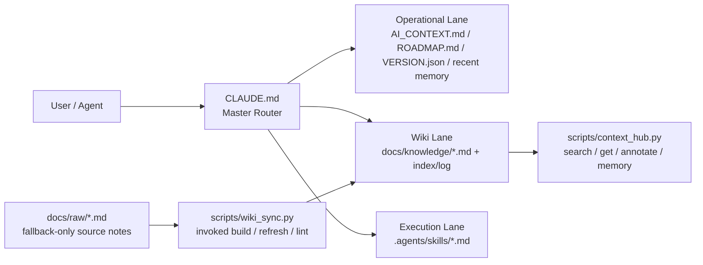

# 🍲 O-ALL-WANT (OAW) Framework

[English](README.en.md) | [中文](README.md)

> Why choose when you can have it all?

<p align="center">
  
</p>

This is an AI Harness hodgepodge designed specifically for "greedy" developers. We want AI not only to write code for us, but also to maintain cross-session memory, save tokens, and ideally compile scattered knowledge into an evolving Wiki—just like Andrej Karpathy suggested.

This project is the culmination of several late nights bossing around Codex GPT 5.4, integrating some of the most popular Harness repositories, Memory Palace concepts, and Token optimization logic into one cohesive framework.

So what I want is actually very simple:

- It must write code.
- It must not lose memory across sessions.
- It must save tokens—do not read the entire repo every time.
- It must slowly compile scattered notes into a reusable knowledge wiki.
- It must capture repeated workflows into skills and scripts, instead of restating them every time.

If you only need a single feature, please directly Fork the original author's repository (don't waste your time here). But if you are like me and want it all, here you go:

## 🛠 Hodgepodge Inventory

- 🧠 **Memory Palace**: Gives your Agent persistent memory, so it doesn't forget mid-conversation.
  The core of this layer lands in `.agents/memory.md` and a structured wrap-up discipline.
- 📉 **Token Optimizer**: Spends every token where it counts through precise Context routing.
  The core approach is using `CLAUDE.md` as the master router, reading by lane lazily.
- 📚 **LLM Wiki (Karpathy Concept)**: Automates the knowledge compilation process, so AI helps you organize a textbook instead of flipping through random PDFs every time.
  The core combination is `docs/raw/`, `docs/knowledge/`, and `scripts/wiki_sync.py`.
- ⚡ **Agentic Workflows**: Pre-configured Markdown-driven SOPs, so high-frequency tasks don't need to be explained repeatedly.
  This layer primarily lands in `.agents/skills/*.md` and helper scripts.

## Architecture Diagram

`CLAUDE.md` decides which lane a task should take; it only reads wikis, skills, or raw notes when strictly necessary, preventing the entire repo and all rules from being shoved into context right away.



## Quick Start

Measured on 2026-04-13: clone + install + first successful `python3 scripts/context_hub.py status` completed in 3.55s on macOS.

### Plan A: The Merger

If you already have a project and want to evolve it into an agent workspace that retains memory and saves tokens:

```bash
cd /path/to/your/project
git clone https://github.com/lihowfun/agent-memory-framework.git .agent-framework
bash .agent-framework/install.sh
```

After installation, just do three things:

1. Edit `CLAUDE.md`
2. Edit `AI_CONTEXT.md`
3. Tell your agent: `Read CLAUDE.md first, then AI_CONTEXT.md.`

If you want the AI to integrate it for you directly, you can pass this prompt:

> Please analyze this OAW framework, keep my original project structure, and help me integrate memory, token routing, skills, and wiki sync.

### Plan B: The Architect

If you don't have a project yet and want to build a rather complete harness from scratch:

```bash
mkdir my-project && cd my-project
git init
git clone https://github.com/lihowfun/agent-memory-framework.git .agent-framework
bash .agent-framework/install.sh
```

Next, let the AI read:

- `CLAUDE.md`
- `AI_CONTEXT.md`
- `ROADMAP.md`

Then give the command:

> Referencing OAW's logic, help me design a custom development harness. Keep it concise initially, but preserve the expansion space for memory, wiki, and skills.

## 📖 How to use the LLM Wiki?

**When should you use the LLM Wiki?**
When you have "messy meeting notes," "verbose technical documents," or "quick bug analyses" that you want the AI to remember, but blindly feeding them to the AI every time wastes too many tokens and causes the AI to lose focus or hallucinate.

**Workflow (Demo):**
1. **Drop in the Draft (Raw):** Just drop your messy notes or raw text files into the `docs/raw/` directory (e.g., create a `docs/raw/api_notes.md`).
2. **Let AI Compile (Compile):** Run the command `python3 scripts/wiki_sync.py refresh api_notes`
3. **Done:** The script will automatically distill the chaotic draft into a structured, concise formal document in `docs/knowledge/`, and automatically update the index page.
4. **Future Use:** From then on, when your Agent looks up project information, it will read the curated essence in `docs/knowledge/`—saving tokens and remaining highly precise!

## Why won't this become a mess?

Because it does not force all rules into the same prompt; it separates responsibilities:

- `CLAUDE.md` is responsible for deciding where to read first.
- `AI_CONTEXT.md` is responsible for project facts and commands.
- `.agents/skills/` is responsible for repeated workflows.
- `scripts` is responsible for mechanical maintenance.

So, it is a modularised "I want it all", not a pile of all rules jumbled together.

## Inspirations / Source Lineage (Standing on the shoulders of giants)

The core philosophy of this framework merges concepts from the following excellent projects and ideas:

- 🧠 **[Memory Palace / MemPalace](https://github.com/MemPalace/mempalace)**: Fixes mid-task amnesia using structured wrap-ups
- 📉 **[andrewyng/context-hub](https://github.com/andrewyng/context-hub)**: Provides the basis for searchable knowledge, annotation, and session continuity
- 📚 **[Karpathy-style LLM Wiki](https://gist.github.com/karpathy/442a6bf555914893e9891c11519de94f)**: The concept of separating raw notes from actively compiled, durable wikis
- ⚡ **[Thin harness / fat skills (Garry Tan)](https://x.com/garrytan/status/2042925773300908103)**: The philosophy of encapsulating workflows in skills, keeping the router thin

If you want to see a more complete source comparison and integration rationale, please check:

- [Architecture Origins](docs/Architecture_Origins.md)
- [Design Principles](docs/Design_Principles.md)

## Common Tool Commands

The following are not "mysterious spells," they are just the most common helpers for this framework:

| Command | Purpose |
|------|------|
| `status` | View current version, recent decisions, knowledge topics, and raw source counts |
| `search` | Search wiki topics or content |
| `memory add` | Record new decisions / bugs / insights |
| `annotate` | Append an AI annotation to a specified knowledge page |
| `wiki_sync lint` | Check if raw and wiki metadata are consistent |

```bash
python3 scripts/context_hub.py status
python3 scripts/context_hub.py search "bug"
python3 scripts/context_hub.py memory add "[DECISION] Switched to approach X"
python3 scripts/context_hub.py annotate Known_Limitations "[BUG] Reproduced on Windows"
python3 scripts/wiki_sync.py lint
```

## Examples + Docs

- Examples:
  - [Minimal Install Fixture](example/minimal-project/README.md): A snapshot of a minimal completed installation.
  - [Public Hybrid Demo](example/public-hybrid-demo/README.md): A public example featuring raw notes, compiled wikis, and skills.
- Docs:
  - [CLI Reference](docs/CLI_Reference.md)
  - [Skill Guide](docs/Skill_Guide.md)
  - [Wiki Sync Guide](docs/Wiki_Sync_Guide.md)
  - [Architecture Origins](docs/Architecture_Origins.md)
  - [Design Principles](docs/Design_Principles.md)
  - [OAW README Refresh Report](docs/archive/OAW_README_REFRESH_REPORT.md)

## License

MIT
