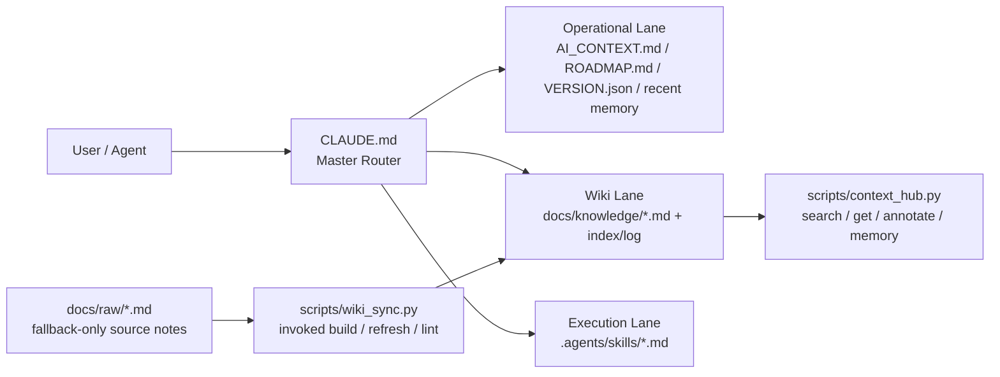

# 🍲 O-ALL-WANT (OAW) Framework

<div align="center">

[](https://opensource.org/licenses/MIT)
[](https://github.com/lihowfun/O-ALL-WANT/stargazers)
[](https://github.com/lihowfun/O-ALL-WANT/commits/main)
[](https://github.com/lihowfun/O-ALL-WANT/issues)
[](docs/knowledge/OAW_Session_Continuity_Test.md)

</div>

<div align="center">
  <a href="README.md">English</a> |
  <a href="README.zh.md">中文</a> |
  <a href="https://www.readme-i18n.com/lihowfun/O-ALL-WANT?lang=ja">日本語</a> |
  <a href="https://www.readme-i18n.com/lihowfun/O-ALL-WANT?lang=ko">한국어</a> |
  <a href="https://www.readme-i18n.com/lihowfun/O-ALL-WANT?lang=de">Deutsch</a> |
  <a href="https://www.readme-i18n.com/lihowfun/O-ALL-WANT?lang=fr">Français</a> |
  <a href="https://www.readme-i18n.com/lihowfun/O-ALL-WANT?lang=es">Español</a>
</div>

> Why choose when you can have it all?
> Kids choose. Builders want the whole stack.

<p align="center">
  
</p>

> **TL;DR** — OAW turns your repo's `CLAUDE.md` into an agent router: lane-based context loading + durable memory + auto-compiled wiki, so AI coding sessions **resume instead of restart**.
>
> **Built for** developers hopping between Claude Code / Codex / Copilot / Cursor who want context to survive rate limits, session resets, and multi-agent workflows.
>
> **3 steps**: `git clone` → `bash install.sh` → paste one line to your agent. Full Quick Start [below](#-quick-start).

## Why are you here?

This is a harness for unapologetically greedy agentic coders.

If you hop between AI coding platforms and treat token efficiency like a competitive sport, you probably know the heartbreak: the chat gets long, the agent gets stupid, the session resets, and suddenly you are paying premium tokens just to re-explain the repo before any real work happens. You do not even reach the hard part before seeing `You have hit your limit`.

OAW is my answer to that waste.

It came out of too many late nights pushing Claude Code and Codex harder than any reasonable coworker should, then taking the sharpest bits from other people's public work — self-improving workflows, Context Hub, MemPalace, Karpathy-style LLM Wiki patterns, Garry Tan's thin-harness / fat-skills framing — and stewing them into one unapologetically overloaded hot pot.

The goal is simple: **spend expensive tokens on real reasoning and real output** — not on replaying finished work or reteaching the project every time a session dies.

My rule is simple: if a repo is going to be touched by AI more than once, I bootstrap it with OAW first. Then when rate limits, queue pressure, multi-agent workflows, or a forced session reset show up, the next agent can keep moving instead of making me retell the whole story.

> **Only want one piece of this?** Fork the original project that does that one thing best (see Source Lineage below). This repo is for people who want the whole hot pot.

---

## 🍲 What's in the hot pot?

### 🔄 Self-improving logic
`VERSION.json` + `ROADMAP.md` + `do_not_rerun` give the agent a sense of progress so it doesn't spin in circles. Borrowed from the `self-improving-agent` / ClawHub workflow: log mistakes, preserve corrections, learn over time.

### 📉 Token optimizer — Context Hub + RTK-inspired output trimming
`CLAUDE.md` routes by lane and only loads what matters right now. `context_hub.py` handles search, annotate, and memory. `--compact` extends the idea to output: shorten what comes back when full prose is unnecessary.

### ⚡ thin harness / fat skills (Garry Tan)
Repeated workflows live in `.agents/skills/*.md`, not in one giant prompt blob. OAW keeps that spirit and layers dynamic routing on top.

### 🧠 Memory Palace
Durable cross-session memory instead of snapping back to zero every conversation. `.agents/memory.md` + structured wrap-up discipline hold the state.

### 📚 Auto-evolving LLM Wiki (Karpathy concept)
Raw notes in `docs/raw/` compile into durable pages in `docs/knowledge/`. After any meaningful session, just tell the agent _"sync today's findings to the wiki"_ — it calls `wiki_sync.py refresh` to distill memory entries into a structured knowledge page. No manual reorganization.

---

### 🤝 Optional companion: RTK (Rust Token Killer)
OAW's `--compact` already bakes in the "shorten what comes back" idea. For Rust-native extreme token compression, go straight to [rtk-ai/rtk](https://github.com/rtk-ai/rtk).

---

## 🏗️ Architecture Design
OAW's core is **Context Routing**: `CLAUDE.md` acts as a Master Router, dynamically deciding which lane to load based on the current task. Skills and scripts handle the repetitive execution layer. Each session only injects the context that is actually needed right now — not the entire repo.



---

### 🛡️ Harness Engineering — Three Load-Bearing Principles

Each one addresses a common pain point in agentic coding sessions:

| Principle | Implementation | Problem Solved |
|-----------|---------------|----------------|
| **[Context Fragmentation](docs/knowledge/Harness_Engineering_Context_Fragmentation.md)**<br/>Dynamic context partitioning | Lane routing — only load files relevant to the current task type | Prevents **Lost in the Middle** degradation in long-context sessions |
| **[Deterministic State Control](docs/knowledge/Harness_Engineering_Deterministic_State.md)**<br/>State machine for agent progress | `VERSION.json` + `do_not_rerun` enforce a development state machine | Stops agents from rerunning finished work or looping in autonomous repair |
| **[Knowledge Synthesis](docs/knowledge/Harness_Engineering_Knowledge_Synthesis.md)**<br/>Short-term → long-term distillation | `memory.md` (decisions) → `knowledge/` (durable wiki) auto-compiled by `wiki_sync.py` | Turns ephemeral Agentic Workflow outputs into reusable institutional knowledge |

---

## 🔁 What actually changes on a new session

| On cold start, the agent… | Without OAW | With OAW |
|---|---|---|
| Knows what this repo does | ❌ You paste architecture recap each session | ✅ Reads `CLAUDE.md` + `AI_CONTEXT.md` baseline |
| Knows recent decisions | ❌ You recap from memory | ✅ `.agents/memory.md` last 5 entries, loaded on demand |
| Knows which workflows are repeatable SOPs | ❌ You re-explain each one | ✅ `.agents/skills/` triggered by intent keywords |
| Avoids re-running finished work | ❌ Risk of loops in autonomous repair | ✅ `VERSION.json` `do_not_rerun` enforced |

> **Measured**: lane routing loads only the files relevant to the current task — ~3k tokens per lane vs ~22.6k for loading everything, [**86–87% savings**](docs/knowledge/OAW_Session_Continuity_Test.md) in the session continuity test. The baseline (`CLAUDE.md` + `AI_CONTEXT.md`, ~2.3k tokens) is always loaded; lane-specific files add ~400–800 tokens on top.

---

## ⚡ Quick Start

### 🆕 Brand-new project

```bash
mkdir my-project && cd my-project && git init
git clone https://github.com/lihowfun/O-ALL-WANT.git OAW
bash OAW/install.sh
```

Then paste to your agent:

> Read `CLAUDE.md` first, then `AI_CONTEXT.md`.
> Match the architecture, fill in this project's actual state, then tell me which repeated workflows belong in `.agents/skills/`.

### 📂 Existing project

If you already have your own `CLAUDE.md` / `AI_CONTEXT.md`, `install.sh` **lists every managed file it would write** and waits for `y/N` confirmation — nothing is silently overwritten. Want to eyeball OAW first? Browse [`example/minimal-project/`](example/minimal-project/) or `OAW/templates/`.

```bash
cd /path/to/your/project
git clone https://github.com/lihowfun/O-ALL-WANT.git OAW
bash OAW/install.sh     # at the "Overwrite?" prompt it prints each conflict; answer N to abort
```

Then paste to your agent:

> Read `CLAUDE.md` first, then `AI_CONTEXT.md`. Based on OAW's architecture, audit this project and suggest how to optimize it.

### 🔌 Adapting to different agents / IDEs

**Primary test targets**: Claude Code, OpenAI Codex (used daily to develop this repo). Everything else has an adapter shipped, field reports welcome.

The router file is always `CLAUDE.md`, but different agents look for different startup files:

| Agent / IDE | Default file | OAW adapter |
|-------------|-------------|-------------|
| **Claude Code** | `CLAUDE.md` | ✅ Works out of the box |
| **GitHub Copilot** | `.github/copilot-instructions.md` | ✅ Auto-created by installer, points to `CLAUDE.md` |
| **OpenAI Codex** | `AGENTS.md` | One-line pointer: `Read CLAUDE.md for project rules.` |
| **Cursor** | `.cursorrules` | Same |
| **Windsurf** | `.windsurfrules` | Same |
| **Gemini** | `GEMINI.md` | Same |

If you do not want to think about it, just tell the agent: "read CLAUDE.md first."

---

## 💬 One-line SOP Dispatch

OAW's operating philosophy: **you describe intent, the agent finds and runs the matching SOP**.

The mechanism is **Skills-First Principle** — before responding, the agent checks `.agents/skills/` for a match. If there is one, it follows the pre-written workflow. If not, it improvises. The payoff: **repeatable processes are not subject to LLM randomness; one-off problems still get creative headroom**.

| You say... | Agent triggers... |
|-----------|-------------------|
| "I just decided to switch to Redis for caching" | Write to `.agents/memory.md` → `[DECISION] Switch to Redis` |
| "This bug is caused by an N+1 query" | Write to memory; suggest wiki distillation when similar entries pile up |
| "Help me organize the notes in `docs/raw/`" | Trigger `/wiki-refresh` → `wiki_sync.py refresh` → produce a knowledge page |
| "Run a benchmark" | Trigger `/benchmark` → read baselines → execute → generate report |
| "Prepare release v1.2.0" | Trigger `/version-release` → run full checklist |
| "This is broken, help me debug" | Trigger `/debug-pipeline` → diagnose layer by layer → record root cause |
| "What's the current project status?" | `context_hub.py status` → version + recent decisions + knowledge topics |

Details: [Skill Guide](docs/Skill_Guide.md).

---

### 🔧 Direct CLI (Bypass Agent)

Prefer driving the tools manually? These go straight to the underlying layer:

| Command | Purpose |
|---------|---------|
| `python3 scripts/context_hub.py status` | Version + recent decisions + knowledge topics |
| `python3 scripts/context_hub.py setup` | Audit unfilled `${...}` placeholders in key files (run right after install) |
| `python3 scripts/context_hub.py search "keyword"` | Search the knowledge base |
| `python3 scripts/context_hub.py search "keyword" --include-memory` | Search knowledge + `memory.md` together |
| `python3 scripts/context_hub.py context --lane [operational\|wiki\|execution\|debug]` | List the files that belong to one lane |
| `python3 scripts/context_hub.py memory add "[TAG] content"` | Manually write to memory |
| `python3 scripts/wiki_sync.py refresh topic_name` | Compile one wiki topic |
| `python3 scripts/wiki_sync.py lint` | Check metadata consistency |
| `python3 scripts/wiki_sync.py lint --strict` | Also flag unfilled `${...}` / `YYYY-MM-DD` markers |

Full list: [CLI Reference](docs/CLI_Reference.md).

---

## 🐕 Self-hosting: the repo is its own first user

The root `CLAUDE.md`, `AI_CONTEXT.md`, and related files are the **OAW team's own** working copies, not the generic template you install. Your installable version lives in `templates/`, and `install.sh` copies it into your project.

**Public memory policy**: `.agents/memory.md` is gitignored because memory is a local diary. The public artifact is distilled knowledge in `docs/knowledge/`.

---

## Source Lineage (standing on the shoulders of giants)

Below are OAW's inspirations and references. Some involved studying actual source code; others were concept-level influence only:

**Source code studied**

- 📉 **[andrewyng/context-hub](https://github.com/andrewyng/context-hub)** (MIT) — `context_hub.py` is directly architected from this repo: searchable knowledge, annotations, routing
- 🧠 **[Memory Palace / MemPalace](https://github.com/MemPalace/mempalace)** (MIT) — `.agents/memory.md` structure and wrap-up discipline come from this repo

**Concept-level inspiration (articles / tweets / skill pages, not source code)**

- 🔄 **[self-improving-agent / ClawHub skill pattern](https://clawhub.ai/skills/self-improver)** — the `do_not_rerun`, session-end report, and failure-logging concepts; OAW reimplemented these independently
- 📚 **[Karpathy-style LLM Wiki](https://gist.github.com/karpathy/442a6bf555914893e9891c11519de94f)** — the raw-notes-vs-compiled-wiki philosophy that inspired the `docs/raw/` → `docs/knowledge/` architecture
- ⚡ **[thin harness / fat skills (Garry Tan)](https://x.com/garrytan/status/2042925773300908103)** — tweet concept: push repeated work into skills, keep the router lean
- 🤝 **[RTK (rtk-ai/rtk)](https://github.com/rtk-ai/rtk)** — concept reference for output-side token reduction; OAW does not bundle RTK, but `--compact` follows the same "shorten what comes back" idea

This list will keep growing. When something fits OAW cleanly, it goes in.

Deeper reading: [Architecture Origins](docs/Architecture_Origins.md) · [Design Principles](docs/Design_Principles.md)

## Examples + Docs

- Examples: [`example/`](example/) (start with `minimal-project/`)
- [CLI Reference](docs/CLI_Reference.md) · [Skill Guide](docs/Skill_Guide.md) · [Wiki Sync Guide](docs/Wiki_Sync_Guide.md)
- [CONTRIBUTING.md](CONTRIBUTING.md) · [CHANGELOG.md](CHANGELOG.md)

## License

MIT
