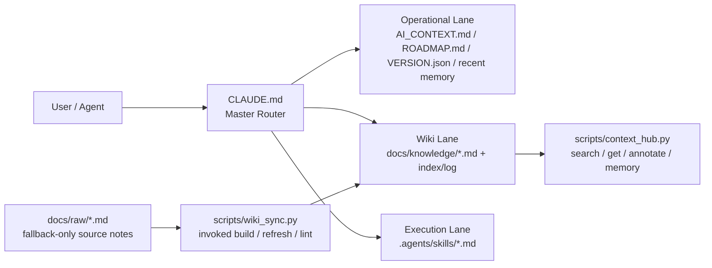

# 🍲 O-ALL-WANT (OAW) Framework

[English](README.en.md) | [中文](README.md)

> Why choose when you can have it all?

<p align="center">
  
</p>

## 為什麼會在這?

這個 AI harness 大雜燴是為「貪心」的開發者做的。你要 AI 寫 code,還要它:

- 🧠 **跨 session 不失憶** — `.agents/memory.md` 記決策 / bug / 發現,agent 自動寫
- 📉 **不要每次把整個 repo 全讀一遍** — `CLAUDE.md` 當 router,lane 式 lazy-read,省 token
- 📚 **碎筆記自動編成可重用的 wiki**(Karpathy 風) — `docs/raw/` → `docs/knowledge/`,`scripts/wiki_sync.py` 編
- ⚡ **重複流程收進 SOP,別再每次重講** — `.agents/skills/*.md`

全都要,我也是。這個 repo 是我在幾個下班的夜晚,奴役 Claude Code 跟 Codex,把市面上幾個火熱的 harness / memory palace / token optimization 整合出來的結晶。

**只需要其中一樣?** 請直接 fork 對應的原作(列在最下面的 Source Lineage),別在這浪費時間。

### 🤝 可選搭配:RTK (Rust Token Killer)

OAW 管「知識路由」(讀什麼);RTK 管「shell output 壓縮」(回多少)。不同層,互補。

```bash
brew install rtk && rtk init -g
```

## 架構一頁看懂

`CLAUDE.md` 先決定要走哪條 lane,只在需要時才讀後面的檔案。不會一上來就把整個 repo 塞進 context。



裝完你會看到這些檔案:

| 檔案 | 職責 | 你要動嗎? |
|------|------|----------|
| `CLAUDE.md` | Agent 大腦:決定讀哪、調度哪個 skill | ✅ 安裝時填一次 `${LANGUAGE}` |
| `AI_CONTEXT.md` | 專案百科:架構、技術堆疊、baseline | ✅ 安裝時填一次 |
| `.agents/memory.md` | 短期日記:決策 / bug / 發現 | ❌ agent 自動記 |
| `docs/knowledge/` | 長期知識:精華頁(AI 讀這裡) | ❌ agent 從 `docs/raw/` 自動編 |
| `.agents/skills/*.md` | SOP 庫:按 task 調度 | 視需要:寫自己的 skill |
| `scripts/*.py` | 機械維護:搜尋、編譯 wiki | ❌ agent 會呼叫 |

> 💡 **Memory vs Knowledge**:Memory 是日記(短期事件),Knowledge 是教科書(長期知識)。同類 memory 累積 3-5 條就可以叫 agent「幫我提煉到 wiki」。

## 快速上手

```bash
# 既有專案:直接進你的 repo
cd /path/to/your/project

# 全新專案:先 init
# mkdir my-project && cd my-project && git init

git clone https://github.com/lihowfun/O-ALL-WANT.git .agent-framework
bash .agent-framework/install.sh
```

裝完對 agent 講(直接複製):

> 先讀 `CLAUDE.md`,再讀 `AI_CONTEXT.md`。
> 幫我把 `${LANGUAGE}` 換成我的溝通語言,
> 把 `AI_CONTEXT.md` 的 placeholder 換成這個專案的真實資訊。
> 然後分析 codebase,建議哪些重複流程可以收進 `.agents/skills/`。

### 🔌 不同 Agent / IDE 的對應方式

Router 永遠叫 `CLAUDE.md`,但不同 agent 預設讀不同的規則檔:

| Agent / IDE | 預設讀取 | OAW 對應方式 |
|-------------|---------|-------------|
| **Claude Code** | `CLAUDE.md` | ✅ 安裝後直接對應 |
| **GitHub Copilot** | `.github/copilot-instructions.md` | ✅ 安裝時自動建立,指向 `CLAUDE.md` |
| **OpenAI Codex** | `AGENTS.md` | 建一行 pointer:`Read CLAUDE.md for project rules.` |
| **Cursor** | `.cursorrules` | 同上 |
| **Windsurf** | `.windsurfrules` | 同上 |
| **Gemini** | `GEMINI.md` | 同上 |

嫌麻煩也可以直接跟 agent 說「先讀 CLAUDE.md」,效果一樣。

## 🧭 你講人話,Agent 做事

**核心原則**:你主要只要跟 agent 講話。前提是它會讀 `CLAUDE.md` 並遵守 Skills-First Principle。

| 你跟 Agent 說... | Agent 通常會做... |
|-----------------|------------------|
| 「我剛決定改用 Redis 當 cache」 | 寫入 `.agents/memory.md` → `[DECISION] 改用 Redis` |
| 「這個 bug 是 N+1 query 造成的」 | 寫入 memory;累積多條時主動提議提煉到 wiki |
| 「幫我整理一下 `docs/raw/` 的筆記」 | 比對到 `/wiki-refresh` skill → `wiki_sync.py refresh` → 產 knowledge 頁 |
| 「跑一下 benchmark」 | 比對到 `/benchmark` skill → 讀 baselines → 執行 → 產報告 |
| 「準備 release v1.2.0」 | 比對到 `/version-release` skill → 完整 checklist |
| 「這東西壞了,幫我 debug」 | 比對到 `/debug-pipeline` skill → 逐層排查 → 記錄 root cause |
| 「目前專案什麼狀態?」 | `context_hub.py status` → 版本 + 最近決策 + 知識主題 |

細節:[Skill Guide](docs/Skill_Guide.md)。

### 想直接下指令(不透過 agent)?

| 指令 | 用途 |
|------|------|
| `python3 scripts/context_hub.py status` | 版本 + 近期決策 + 知識主題 |
| `python3 scripts/context_hub.py search "關鍵字"` | 搜尋知識庫 |
| `python3 scripts/context_hub.py memory add "[TAG] 內容"` | 手動記到 memory |
| `python3 scripts/wiki_sync.py refresh topic_name` | 編譯某個 wiki 主題 |
| `python3 scripts/wiki_sync.py lint` | 檢查 metadata |
| `python3 scripts/wiki_sync.py lint --strict` | 另外抓未填的 `${...}` / `YYYY-MM-DD` |

完整列表:[CLI Reference](docs/CLI_Reference.md)。

## 🐕 Self-Hosting:repo 自己是自己的第一個用戶

Root 的 `CLAUDE.md` / `AI_CONTEXT.md` 等是 **OAW 團隊自用**的版本,不是給你的 template(你的 template 住在 `templates/`,`install.sh` 會幫你裝)。

**Public memory policy**:`.agents/memory.md` 已 gitignore(memory 是本地日記)。公開分享的是提煉後的 `docs/knowledge/`(教科書)。

## Source Lineage (站在巨人肩膀上)

OAW 沒複製這些 repo 的原始碼,但設計理念深受以下影響:

- 🧠 **[Memory Palace / MemPalace](https://github.com/MemPalace/mempalace)** (MIT) — 中途失憶 + structured wrap-up
- 📉 **[andrewyng/context-hub](https://github.com/andrewyng/context-hub)** (MIT) — searchable knowledge + annotate + routing
- 📚 **[Karpathy-style LLM Wiki](https://gist.github.com/karpathy/442a6bf555914893e9891c11519de94f)** — 隨手筆記 vs 編譯後 wiki 的分離哲學
- ⚡ **[thin harness / fat skills (Garry Tan)](https://x.com/garrytan/status/2042925773300908103)** — 把高頻操作收進獨立 skill

深入:[Architecture Origins](docs/Architecture_Origins.md) · [Design Principles](docs/Design_Principles.md)

## Examples + Docs

- 範例:[`example/`](example/)(從 `minimal-project/` 開始)
- [CLI Reference](docs/CLI_Reference.md) · [Skill Guide](docs/Skill_Guide.md) · [Wiki Sync Guide](docs/Wiki_Sync_Guide.md)
- [CONTRIBUTING.md](CONTRIBUTING.md) · [CHANGELOG.md](CHANGELOG.md)

## License

MIT
