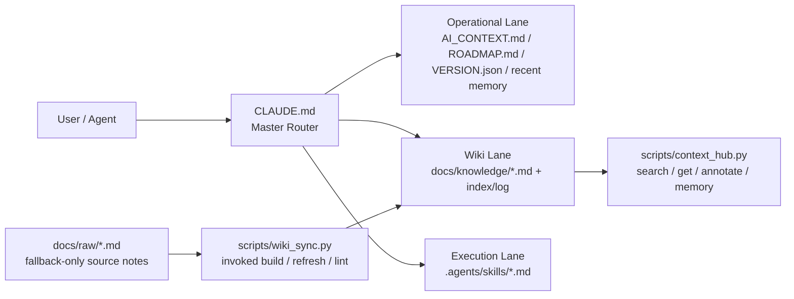

# 🍲 O-ALL-WANT (OAW) Framework

[English](README.en.md) | [中文](README.md)

> Why choose when you can have it all?

<p align="center">
  
</p>

這是一個專為「貪心」的開發者設計的 AI Harness 大雜燴。我們不只想要 AI 幫我們寫
Code，還要它跨 session 不失憶、別浪費 Token，最好還能像 Andrej Karpathy
說的那樣，順手把碎知識慢慢編成一套會演進的 Wiki。

本專案是我在數個下班後的夜晚，透過奴役 Claude Code 與 Codex，把市面上幾個最火熱的 Harness Repo、記憶宮殿做法與 Token 優化邏輯整合在一起的結晶。

所以我要的其實很簡單:

- 要能寫 code
- 要能跨 session 不失憶
- 要能省 token，不要每次都把整個 repo 全讀一遍
- 要能把碎筆記慢慢編成可重用的知識 wiki
- 要能把重複流程收進 skills 和 scripts，而不是每次重講一次

如果你只需要單一功能，請直接去 Fork 對應的原作（別在這裡浪費時間）；
但如果你跟我一樣全都要，這裡有：

## 🛠 內含大雜燴清單

- 🧠 **Memory Palace (記憶宮殿)**: 讓你的 Agent 擁有持久化記憶，不再對話到一半就失憶。
  這一層的核心落點是 `.agents/memory.md` 與結構化 wrap-up discipline。
- 📉 **Token Optimizer**: 透過精密的 Context 路由，把每一分 Token 都花在刀口上。
  核心做法是讓 `CLAUDE.md` 當 master router，按 lane lazy-read。
- 📚 **LLM Wiki (Karpathy Concept)**: 自動化知識編譯流程，讓 AI 幫你整理教科書，而不是每次亂翻 PDF。
  核心組合是 `docs/raw/`、`docs/knowledge/` 和 `scripts/wiki_sync.py`。
- ⚡ **Agentic Workflows**: 預置多套 Markdown 導向的 SOP，讓高頻任務不要每次重講。
  這一層主要落在 `.agents/skills/*.md` 和 helper scripts。

## 架構圖

先由 `CLAUDE.md` 決定這次任務該走哪條 lane；只有真的需要時才讀 wiki、
skills 或 raw notes，所以不會一上來就把整個 repo 和所有規則塞進 context。



## 快速上手

### 方案 A: 已有專案 — 讓 AI 幫你加裝 harness

```bash
cd /path/to/your/project
git clone https://github.com/lihowfun/agent-memory-framework.git .agent-framework
bash .agent-framework/install.sh
```

安裝完成後，丟這段給你的 AI agent：

> 先讀 `CLAUDE.md`，再讀 `AI_CONTEXT.md`。
> 根據我這個專案的語言和架構，幫我客製化這兩個檔案：
> 把 `CLAUDE.md` 裡的 `${LANGUAGE}` 換成我的溝通語言，
> 把 `AI_CONTEXT.md` 裡的 placeholder 換成我的真實專案資訊。
> 然後分析我的 codebase，建議哪些重複流程可以收進 `.agents/skills/`。

### 方案 B: 從零開始 — 讓 AI 幫你規劃新專案

```bash
mkdir my-project && cd my-project
git init
git clone https://github.com/lihowfun/agent-memory-framework.git .agent-framework
bash .agent-framework/install.sh
```

安裝完成後，丟這段給你的 AI agent：

> 先讀 `CLAUDE.md`，再讀 `AI_CONTEXT.md`。
> 我要做的專案是 [簡述你的專案]。
> 幫我客製化 harness：填好 `AI_CONTEXT.md` 的架構和技術堆疊，
> 設定 `CLAUDE.md` 的語言偏好和 forbidden actions，
> 然後建議初期需要哪些 skills。

## 🎁 安裝完你會看到什麼

```text
your-project/
├── CLAUDE.md              ← Agent 的大腦：決定讀哪些檔案、調度哪個 skill
├── AI_CONTEXT.md          ← 專案百科：AI 讀這裡了解你的專案
├── VERSION.json           ← 版本追蹤 + 鎖定已完成的實驗（避免 AI 重跑）
├── ROADMAP.md             ← 階段計畫：AI 判斷目前進度用
├── .agents/
│   ├── memory.md          ← AI 的日記：自動記錄每次的決策、bug、發現
│   └── skills/            ← AI 的 SOP 庫：觸發關鍵字自動調度
├── docs/
│   ├── knowledge/         ← 精煉知識庫：AI 查資料讀這裡（省 Token）
│   └── raw/               ← 你的原始筆記：AI 只在需要時才讀
└── scripts/
    ├── context_hub.py     ← AI 呼叫的知識管理工具
    └── wiki_sync.py       ← AI 呼叫的 筆記→wiki 編譯器
```

> 💡 **三句話版本**：`CLAUDE.md` 是 Agent 的大腦，`AI_CONTEXT.md` 是你專案的百科，
> `.agents/memory.md` 是 Agent 的日記。其他的，Agent 需要的時候自己會去讀。

## 🧭 什麼時候用什麼？

> **核心原則：你只需要跟 Agent 講話。** Agent 讀了 `CLAUDE.md` 之後，會根據你的需求自動選擇要讀哪些檔案、調度哪個 skill、執行哪個 script。你不需要記指令。

### 你講人話，Agent 自動調度

| 你對 Agent 說... | Agent 會自動做... |
|-----------------|------------------|
| 「我剛決定改用 Redis 當 cache」 | 寫入 `.agents/memory.md` → `[DECISION] 改用 Redis 當 cache` |
| 「這個 bug 是 N+1 query 造成的」 | 寫入 `.agents/memory.md` → `[BUG] N+1 query...`；累積同類多條時主動提議提煉到 wiki |
| 「幫我整理一下 docs/raw/ 裡的筆記」 | 觸發 `/wiki-refresh` skill → 執行 `wiki_sync.py refresh` → 產出 `docs/knowledge/` 精華頁 |
| 「跑一下 benchmark」 | 觸發 `/benchmark` skill → 讀 baselines → 執行 → 產出對比報告 |
| 「準備 release v1.2.0」 | 觸發 `/version-release` skill → 跑完整 checklist → 自動 bump version |
| 「這東西壞了，幫我 debug」 | 觸發 `/debug-pipeline` skill → 逐層排查 → 記錄 root cause |
| 「目前專案什麼狀態？」 | 執行 `context_hub.py status` → 顯示版本、最近決策、知識主題清單 |

### 這是怎麼做到的？

每個 skill 都有 `triggers` 關鍵字（例如 `["benchmark", "evaluate", "test scores"]`）。
`CLAUDE.md` 的 **Skills-First Principle** 讓 Agent 在接到任務時自動比對：

```text
你的需求 → CLAUDE.md (master router) → 比對 skill triggers → 調度對應 skill
                                      → skill 內部自動呼叫 scripts
                                      → 結果寫入 memory / knowledge
```

> 💡 **你唯一要做的事**：把 `CLAUDE.md` 設定好，然後跟 Agent 正常講話。
> 剩下的調度、記錄、知識管理，全部是 Agent 的事。

### 進階：手動使用 CLI（可選）

如果你想直接操作 scripts，以下是常用指令：

| 指令 | 用途 |
|------|------|
| `python3 scripts/context_hub.py status` | 看目前版本、近期決策、知識主題 |
| `python3 scripts/context_hub.py search "關鍵字"` | 搜尋知識庫 |
| `python3 scripts/context_hub.py memory add "[TAG] 內容"` | 手動記錄到 memory |
| `python3 scripts/wiki_sync.py refresh topic_name` | 手動編譯某個 wiki 主題 |
| `python3 scripts/wiki_sync.py lint` | 檢查 wiki metadata 一致性 |

## 為什麼這樣不會變亂

因為它不是把所有規則硬塞進同一個 prompt，而是把責任拆開：

| 層 | 負責什麼 | 對應檔案 |
|----|---------|---------|
| **Router** | 決定先讀哪裡、調度哪個 skill | `CLAUDE.md` |
| **Context** | 專案事實與架構 | `AI_CONTEXT.md` |
| **Skills** | 可重複流程（像 function call） | `.agents/skills/` |
| **Knowledge** | 精煉後的長期知識（省 Token） | `docs/knowledge/` |
| **Memory** | 短期事件日記（決策、bug） | `.agents/memory.md` |
| **Scripts** | 機械維護（搜尋、編譯 wiki） | `scripts/` |

模組化的「我全都要」，不是把所有規則堆成一坨。

### 知識怎麼自動長出來？

你的凌亂筆記（會議記錄、技術草稿、Bug 分析）丟進 `docs/raw/`，
跟 Agent 說「幫我把 api_notes 整理成知識頁」——
Agent 觸發 `/wiki-refresh` skill，自動編譯成 `docs/knowledge/` 裡的精華版。
以後 Agent 查資料讀精華版就好，省 Token 又精準。

> 💡 **Memory vs Knowledge**：Memory 是日記（短期事件），Knowledge 是教科書（長期知識）。
> 同類 memory 累積 3-5 條，就該告訴 Agent「幫我提煉到 wiki」。

## 靈感來源 / Source Lineage (站在巨人肩膀上)

這個 repo 的核心思想揉合了以下幾個非常經典的好專案與概念，讓它們互相補足：

- 🧠 **[Memory Palace / MemPalace](https://github.com/MemPalace/mempalace)**: 解決 Agent 中途失憶與 Structured wrap-up
- 📉 **[andrewyng/context-hub](https://github.com/andrewyng/context-hub)**: 啟發了 searchable knowledge files、annotate 與 routing 機制
- 📚 **[Karpathy-style LLM Wiki](https://gist.github.com/karpathy/442a6bf555914893e9891c11519de94f)**: 把隨手筆記與正式編譯的 Wiki 獨立開來的知識管理流派
- ⚡ **[thin harness / fat skills (Garry Tan)](https://x.com/garrytan/status/2042925773300908103)**: 把高頻操作收進獨立 skill 以保持 router 輕薄的哲學

如果你想看比較完整的來源對照與整合理由，請看：

- [Architecture Origins](docs/Architecture_Origins.md)
- [Design Principles](docs/Design_Principles.md)

## Examples + Docs

- Examples:
  - [Minimal Install Fixture](example/minimal-project/README.md): 一個已安裝完成的最小快照
  - [Public Hybrid Demo](example/public-hybrid-demo/README.md): 一個有 raw notes、compiled wiki、skills 的公開示例
- Docs:
  - [CLI Reference](docs/CLI_Reference.md)
  - [Skill Guide](docs/Skill_Guide.md)
  - [Wiki Sync Guide](docs/Wiki_Sync_Guide.md)
  - [Architecture Origins](docs/Architecture_Origins.md)
  - [Design Principles](docs/Design_Principles.md)

## 🐕 Self-Hosting：這個 repo 本身就是自己的第一個用戶

你可能注意到 repo root 有 `CLAUDE.md`、`AI_CONTEXT.md` 等已客製化的檔案 —
這不是使用者要用的 template，而是 OAW 團隊**用自己的 framework 管理自己的 repo**。

- Root 的 `CLAUDE.md` = OAW 開發用的 master router
- `templates/AGENT_RULES.md` = **你安裝後拿到的 template**（這才是給你的）
- Skills 和 knowledge pages 統一住在 `templates/` 裡

> 💡 這就是 eating our own dog food。如果這個 framework 連管理自己都好用，
> 那它應該也能管理你的專案。

## License

MIT
