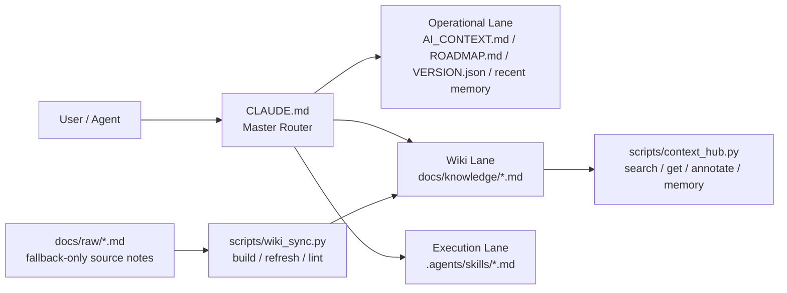

# 🥟 O-ALL-WANT (OAW) Framework

> Why choose when you can have it all?
>
> GitHub repo 名稱仍是 `agent-memory-framework`，但 README 這一版開始用
> `O-ALL-WANT (OAW)` 來描述它的核心精神: 記憶、Token 調度、LLM Wiki、
> SOP workflows，我全都要。

這不是一個單一流派的純血 Harness。

這是把幾個我真的想要的能力硬整合在一起的 markdown-first AI harness:

- 要能寫 code
- 要能跨 session 不失憶
- 要能省 token，不要每次都把整個 repo 全讀一遍
- 要能把碎筆記慢慢編成可重用的知識 wiki
- 要能把重複流程收進 skills 和 scripts，而不是每次重講一次

是的，很多內容真的是我和 Codex GPT 5.4 熬夜一起整理出來的。

## 這包到底有什麼

- 🧠 **Memory layer**: `.agents/memory.md` 讓 agent 有滾動式近期記憶
- 📉 **Token routing**: `CLAUDE.md` 當 master router，按 task lazy-read
- 📚 **LLM Wiki loop**: `docs/raw/` + `docs/knowledge/` + `scripts/wiki_sync.py`
- ⚡ **Agent workflows**: `.agents/skills/*.md` 收 SOP，不靠臨場發揮
- 🛠 **Deterministic helpers**: `context_hub.py` 和 `wiki_sync.py` 把繁瑣事交給程式

## 架構圖



## 快速上手

Measured on 2026-04-13: clone + install + first successful
`python3 scripts/context_hub.py status` completed in 3.55s on macOS.

### 方案 A: The Merger

如果你已經有專案，想把它進化成比較會記、比較會省 token 的 agent workspace:

```bash
cd /path/to/your/project
git clone https://github.com/lihowfun/agent-memory-framework.git .agent-framework
bash .agent-framework/install.sh
```

安裝後只要先做三件事:

1. 編輯 `CLAUDE.md`
2. 編輯 `AI_CONTEXT.md`
3. 告訴你的 agent: `Read CLAUDE.md first, then AI_CONTEXT.md.`

如果你想讓 AI 直接幫你整合，可以丟這句:

> 請分析這個 OAW framework，保留我原本專案的結構，幫我整合 memory、
> token routing、skills 與 wiki sync。

### 方案 B: The Architect

如果你還沒有專案，想從零搭一個比較完整的 harness:

```bash
mkdir my-project && cd my-project
git init
git clone https://github.com/lihowfun/agent-memory-framework.git .agent-framework
bash .agent-framework/install.sh
```

接著讓 AI 先讀:

- `CLAUDE.md`
- `AI_CONTEXT.md`
- `ROADMAP.md`

然後再下指令:

> 參考 OAW 的邏輯，幫我設計一個專屬的開發 harness，先保持簡潔，但保留
> memory、wiki、skills 的擴充空間。

## 為什麼這樣不會變亂

很多人把 memory、wiki、workflow、optimizer 全塞進 repo 後，AI 很快就開始亂。
OAW 的處理方式不是再加更多口號，而是把責任拆開。

| 常見問題 | OAW 的解法 |
|----------|------------|
| 指令權重稀釋 | `CLAUDE.md` 是唯一 startup router，先決定讀什麼，再讀內容 |
| Context Window 浪費 | 用 operational / wiki / execution lanes lazy-read，不一次全讀 |
| 邏輯衝突 | 把 procedure 下放給 scripts 和 skills，不靠 agent 自己記得做 |
| Wiki 變成 always-on 背景工 | `wiki_sync.py` 只在需要時執行，不是每回合強制更新 |

一句話版:

- Router 負責「先看哪裡」
- `AI_CONTEXT.md` 負責「專案事實」
- skills 負責「重複流程」
- scripts 負責「機械維護」

所以它是模組化的「我全都要」，不是把所有規則堆成一坨。

## 靈感來源 / Source Lineage

這個 repo 不是從零憑空長出來的，主要吸收了幾個很實用的方向:

- [Andrew Ng context-hub](https://github.com/andrewyng/context-hub): 搜尋式 knowledge files、annotate 與 session continuity
- [MemPalace](https://github.com/MemPalace/mempalace): anti-amnesia、結構化 wrap-up、跨 session discipline
- Garry Tan 的 thin harness / fat skills 想法: 讓 router 保持薄，把高頻 workflow 收進 skills
- Karpathy-style LLM Wiki concept: raw notes 和 retrieval wiki 分層，讓 markdown 逐步編成 durable knowledge

詳細整合方式請看:

- [Architecture Origins](docs/Architecture_Origins.md)
- [Design Principles](docs/Design_Principles.md)

## 常用指令

```bash
python3 scripts/context_hub.py status
python3 scripts/context_hub.py search "bug"
python3 scripts/context_hub.py memory add "[DECISION] Switched to approach X"
python3 scripts/context_hub.py annotate Known_Limitations "[BUG] Reproduced on Windows"
python3 scripts/wiki_sync.py lint
```

## Examples

- [Minimal Install Fixture](example/minimal-project/README.md): 一個已安裝完成的最小快照
- [Public Hybrid Demo](example/public-hybrid-demo/README.md): 一個有 raw notes、compiled wiki、skills 的公開示例

## Docs

- [CLI Reference](docs/CLI_Reference.md)
- [Skill Guide](docs/Skill_Guide.md)
- [Wiki Sync Guide](docs/Wiki_Sync_Guide.md)
- [Architecture Origins](docs/Architecture_Origins.md)
- [Design Principles](docs/Design_Principles.md)
- [OAW README Refresh Report](docs/OAW_README_REFRESH_REPORT.md)

## FAQ

**我第一天就需要 wiki compiler 嗎？**  
不需要。先用 `CLAUDE.md`、`AI_CONTEXT.md`、`.agents/memory.md` 和
`docs/knowledge/` 就夠了。`docs/raw/` + `wiki_sync.py` 是進階層。

**我一定要用 Python 嗎？**  
不一定。檔案結構本身不依賴 Python。Python 主要是給 `context_hub.py` 和
`wiki_sync.py` 這些 helper 用的。

**這是不是 vector DB 替代品？**  
不是完全替代，而是預設先用 markdown-first、local-first、deterministic-first
的方式處理長期知識。需要更重的 retrieval 再往上疊。

## License

MIT
