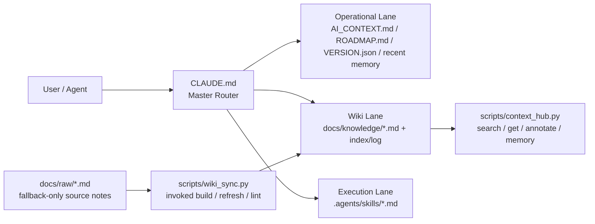

# 🍲 O-ALL-WANT (OAW) Framework

<div align="center">
  <a href="README.md">English</a> |
  <a href="README.zh.md">中文</a> |
  <a href="https://www.readme-i18n.com/lihowfun/O-ALL-WANT?lang=ja">日本語</a> |
  <a href="https://www.readme-i18n.com/lihowfun/O-ALL-WANT?lang=ko">한국어</a> |
  <a href="https://www.readme-i18n.com/lihowfun/O-ALL-WANT?lang=de">Deutsch</a> |
  <a href="https://www.readme-i18n.com/lihowfun/O-ALL-WANT?lang=fr">Français</a> |
  <a href="https://www.readme-i18n.com/lihowfun/O-ALL-WANT?lang=es">Español</a>
</div>

> Why choose when you can have it all?

<p align="center">
  
</p>

## Why are you here?

This is a harness for unapologetically greedy agentic coders.

If you bounce between AI coding platforms, obsess over token efficiency, and have zero patience for goldfish-brain agents, this repo is for you. If you are tired of agents forgetting the project every session, re-reading the whole codebase, and burning through expensive tokens before you even reach the real task, OAW is meant to be the armor layer between you and that chaos.

This project came out of several late nights spent pushing Claude Code and Codex far past reasonable working hours, then remixing ideas from self-improving harnesses, Context Hub, MemPalace, Karpathy-style LLM Wiki workflows, and Garry Tan's thin harness / fat skills framing into one deliberately overloaded setup.

The goal is simple: every expensive token should go toward real reasoning and useful output — not toward replaying finished work or re-explaining your project structure from scratch.

My own use case is pretty consistent: whenever I start a new agentic coding project, or even just a directory I know I will keep handing to AI, I bootstrap it with the OAW harness first. That way, when limits, queue pressure, or shared usage force a fresh session, the next agent can pick up quickly instead of making me restate the whole project again.

**Only want one piece of this?** Fork the original project that does that one thing best (listed below in Source Lineage). This repo is for people who want the whole hot pot.

## 🍲 What's in the hot pot?

- 🔄 **Self-improving logic** — `VERSION.json`, `ROADMAP.md`, and `do_not_rerun` give the agent a sense of progress so it does not spin in circles or rerun finished work. OAW also borrows the `self-improving-agent` / ClawHub workflow of logging mistakes, preserving corrections, and learning over time.
- 📉 **Token optimizer (Context Hub + RTK-inspired output trimming)** — `CLAUDE.md` routes by lane and only loads the context that matters right now, while `context_hub.py` handles search, annotate, and memory operations. `--compact` carries the idea that output should be shortened too when full prose is unnecessary.
- ⚡ **thin harness / fat skills (Garry Tan)** — repeated workflows live in `.agents/skills/*.md`, not in one giant prompt blob. OAW keeps that spirit, then layers dynamic routing on top.
- 🧠 **Memory Palace** — the agent gets durable cross-session memory instead of snapping back to zero every conversation. OAW uses `.agents/memory.md` and structured wrap-up discipline to hold that state.
- 📚 **Auto-evolving LLM Wiki (Karpathy concept)** — raw notes in `docs/raw/` get compiled into durable knowledge pages in `docs/knowledge/`. The wiki grows naturally with your work: after any meaningful session, just tell the agent "sync today's findings to the wiki" and it calls `wiki_sync.py refresh` to distill memory entries and raw notes into a structured knowledge page. No manual reorganization needed.

This repo will keep evolving. Whenever something genuinely useful fits OAW cleanly, it goes in the pot.

### 🤝 Optional companion: RTK (Rust Token Killer)

OAW's `--compact` already bakes in the "shorten what comes back" idea. For Rust-native extreme token compression, go straight to [rtk-ai/rtk](https://github.com/rtk-ai/rtk).

---

## 🏗️ Architecture Design

OAW's core is **Context Routing**: `CLAUDE.md` acts as a Master Router, dynamically deciding which lane to load based on the current task. Skills and scripts handle the repetitive execution layer. Each session only injects the context that is actually needed right now — not the entire repo.



---

### 🛡️ Harness Engineering — Three Load-Bearing Principles

This is not a convenience toolbox. Three engineering principles hold it together:

| Principle | Implementation | Problem Solved |
|-----------|---------------|----------------|
| **Context Fragmentation**<br/>Dynamic context partitioning | Lane routing — only load files relevant to the current task type | Prevents **Lost in the Middle** degradation in long-context sessions |
| **Deterministic State Control**<br/>State machine for agent progress | `VERSION.json` + `do_not_rerun` enforce a development state machine | Stops agents from rerunning finished work or looping in autonomous repair |
| **Knowledge Synthesis**<br/>Short-term → long-term distillation | `memory.md` (decisions) → `knowledge/` (durable wiki) auto-compiled by `wiki_sync.py` | Turns ephemeral Agentic Workflow outputs into reusable institutional knowledge |

---

## ⚡ Quick Start

```bash
# Existing project: go into your repo
cd /path/to/your/project

# Brand-new project: init first
# mkdir my-project && cd my-project && git init

git clone https://github.com/lihowfun/O-ALL-WANT.git OAW
bash OAW/install.sh
```

Then paste this to your agent:

> Read `CLAUDE.md` first, then `AI_CONTEXT.md`.
> Match the architecture to this project's real facts and fill them in, then tell me which repeated workflows belong in `.agents/skills/`.

### 🔌 Adapting to different agents / IDEs

The router file is always `CLAUDE.md`, but different agents look for different startup files:

| Agent / IDE | Default file | OAW adapter |
|-------------|-------------|-------------|
| **Claude Code** | `CLAUDE.md` | ✅ Works out of the box |
| **GitHub Copilot** | `.github/copilot-instructions.md` | ✅ Auto-created by installer, points to `CLAUDE.md` |
| **OpenAI Codex** | `AGENTS.md` | One-line pointer: `Read CLAUDE.md for project rules.` |
| **Cursor** | `.cursorrules` | Same |
| **Windsurf** | `.windsurfrules` | Same |
| **Gemini** | `GEMINI.md` | Same |

If you do not want to think about it, just tell the agent: "read CLAUDE.md first."

---

## 💬 One-line SOP Dispatch

OAW's operating philosophy: **you describe intent, the agent finds and runs the matching SOP**.

The mechanism is **Skills-First Principle** — before responding, the agent checks `.agents/skills/` for a match. If there is one, it follows the pre-written workflow. If not, it improvises. The payoff: **repeatable processes are not subject to LLM randomness; one-off problems still get creative headroom**.

| You say... | Agent triggers... |
|-----------|-------------------|
| "I just decided to switch to Redis for caching" | Write to `.agents/memory.md` → `[DECISION] Switch to Redis` |
| "This bug is caused by an N+1 query" | Write to memory; suggest wiki distillation when similar entries pile up |
| "Help me organize the notes in `docs/raw/`" | Trigger `/wiki-refresh` → `wiki_sync.py refresh` → produce a knowledge page |
| "Run a benchmark" | Trigger `/benchmark` → read baselines → execute → generate report |
| "Prepare release v1.2.0" | Trigger `/version-release` → run full checklist |
| "This is broken, help me debug" | Trigger `/debug-pipeline` → diagnose layer by layer → record root cause |
| "What's the current project status?" | `context_hub.py status` → version + recent decisions + knowledge topics |

Details: [Skill Guide](docs/Skill_Guide.md).

---

### 🔧 Direct CLI (Bypass Agent)

Prefer driving the tools manually? These go straight to the underlying layer:

| Command | Purpose |
|---------|---------|
| `python3 scripts/context_hub.py status` | Version + recent decisions + knowledge topics |
| `python3 scripts/context_hub.py search "keyword"` | Search the knowledge base |
| `python3 scripts/context_hub.py memory add "[TAG] content"` | Manually write to memory |
| `python3 scripts/wiki_sync.py refresh topic_name` | Compile one wiki topic |
| `python3 scripts/wiki_sync.py lint` | Check metadata consistency |
| `python3 scripts/wiki_sync.py lint --strict` | Also flag unfilled `${...}` / `YYYY-MM-DD` markers |

Full list: [CLI Reference](docs/CLI_Reference.md).

---

## 🐕 Self-hosting: the repo is its own first user

The root `CLAUDE.md`, `AI_CONTEXT.md`, and related files are the **OAW team's own** working copies, not the generic template you install. Your installable version lives in `templates/`, and `install.sh` copies it into your project.

**Public memory policy**: `.agents/memory.md` is gitignored because memory is a local diary. The public artifact is distilled knowledge in `docs/knowledge/`.

---

## Source Lineage (standing on the shoulders of giants)

Below are OAW's inspirations and references. Some involved studying actual source code; others were concept-level influence only:

**Source code studied**

- 🔄 **[self-improving-agent / ClawHub skill pattern](https://clawhub.ai/skills/self-improver)** — version / roadmap / do_not_rerun discipline plus the workflow of logging errors, preserving corrections, and learning over time
- 📉 **[andrewyng/context-hub](https://github.com/andrewyng/context-hub)** (MIT) — `context_hub.py` is directly architected from this repo: searchable knowledge, annotations, routing
- 🧠 **[Memory Palace / MemPalace](https://github.com/MemPalace/mempalace)** (MIT) — `.agents/memory.md` structure and wrap-up discipline come from this repo

**Concept-level inspiration (articles / tweets, not source code)**

- 📚 **[Karpathy-style LLM Wiki](https://gist.github.com/karpathy/442a6bf555914893e9891c11519de94f)** — the raw-notes-vs-compiled-wiki philosophy that inspired the `docs/raw/` → `docs/knowledge/` architecture
- ⚡ **[thin harness / fat skills (Garry Tan)](https://x.com/garrytan/status/2042925773300908103)** — tweet concept: push repeated work into skills, keep the router lean
- 🤝 **[RTK (rtk-ai/rtk)](https://github.com/rtk-ai/rtk)** — concept reference for output-side token reduction; OAW does not bundle RTK, but `--compact` follows the same "shorten what comes back" idea

This list will keep growing. When something fits OAW cleanly, it goes in.

Deeper reading: [Architecture Origins](docs/Architecture_Origins.md) · [Design Principles](docs/Design_Principles.md)

## Examples + Docs

- Examples: [`example/`](example/) (start with `minimal-project/`)
- [CLI Reference](docs/CLI_Reference.md) · [Skill Guide](docs/Skill_Guide.md) · [Wiki Sync Guide](docs/Wiki_Sync_Guide.md)
- [CONTRIBUTING.md](CONTRIBUTING.md) · [CHANGELOG.md](CHANGELOG.md)

## License

MIT
