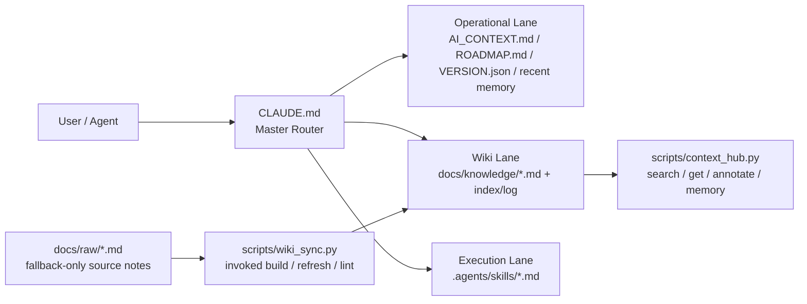

# 🍲 O-ALL-WANT (OAW) Framework

[English](README.en.md) | [中文](README.md)

> Why choose when you can have it all?

<p align="center">
  
</p>

這是一個專為「貪心」的開發者設計的 AI Harness 大雜燴。我們不只想要 AI 幫我們寫
Code，還要它跨 session 不失憶、別浪費 Token，最好還能像 Andrej Karpathy
說的那樣，順手把碎知識慢慢編成一套會演進的 Wiki。

本專案是我在數個下班後的夜晚，透過奴役 Codex GPT 5.4，把市面上幾個最火熱的 Harness Repo、記憶宮殿做法與 Token 優化邏輯整合在一起的結晶。

所以我要的其實很簡單:

- 要能寫 code
- 要能跨 session 不失憶
- 要能省 token，不要每次都把整個 repo 全讀一遍
- 要能把碎筆記慢慢編成可重用的知識 wiki
- 要能把重複流程收進 skills 和 scripts，而不是每次重講一次

如果你只需要單一功能，請直接去 Fork 對應的原作（別在這裡浪費時間）；
但如果你跟我一樣全都要，這裡有：

## 🛠 內含大雜燴清單

- 🧠 **Memory Palace (記憶宮殿)**: 讓你的 Agent 擁有持久化記憶，不再對話到一半就失憶。
  這一層的核心落點是 `.agents/memory.md` 與結構化 wrap-up discipline。
- 📉 **Token Optimizer**: 透過精密的 Context 路由，把每一分 Token 都花在刀口上。
  核心做法是讓 `CLAUDE.md` 當 master router，按 lane lazy-read。
- 📚 **LLM Wiki (Karpathy Concept)**: 自動化知識編譯流程，讓 AI 幫你整理教科書，而不是每次亂翻 PDF。
  核心組合是 `docs/raw/`、`docs/knowledge/` 和 `scripts/wiki_sync.py`。
- ⚡ **Agentic Workflows**: 預置多套 Markdown 導向的 SOP，讓高頻任務不要每次重講。
  這一層主要落在 `.agents/skills/*.md` 和 helper scripts。

## 架構圖

先由 `CLAUDE.md` 決定這次任務該走哪條 lane；只有真的需要時才讀 wiki、
skills 或 raw notes，所以不會一上來就把整個 repo 和所有規則塞進 context。



## 快速上手

Measured on 2026-04-13: clone + install + first successful
`python3 scripts/context_hub.py status` completed in 3.55s on macOS.

### 方案 A: The Merger

如果你已經有專案，想把它進化成比較會記、比較會省 token 的 agent workspace:

```bash
cd /path/to/your/project
git clone https://github.com/lihowfun/agent-memory-framework.git .agent-framework
bash .agent-framework/install.sh
```

安裝後只要先做三件事:

1. 編輯 `CLAUDE.md`
2. 編輯 `AI_CONTEXT.md`
3. 告訴你的 agent: `Read CLAUDE.md first, then AI_CONTEXT.md.`

如果你想讓 AI 直接幫你整合，可以丟這句:

> 請分析這個 OAW framework，保留我原本專案的結構，幫我整合 memory、
> token routing、skills 與 wiki sync。

### 方案 B: The Architect

如果你還沒有專案，想從零搭一個比較完整的 harness:

```bash
mkdir my-project && cd my-project
git init
git clone https://github.com/lihowfun/agent-memory-framework.git .agent-framework
bash .agent-framework/install.sh
```

接著讓 AI 先讀:

- `CLAUDE.md`
- `AI_CONTEXT.md`
- `ROADMAP.md`

然後再下指令:

> 參考 OAW 的邏輯，幫我設計一個專屬的開發 harness，先保持簡潔，但保留
> memory、wiki、skills 的擴充空間。

## 📖 怎麼使用 LLM Wiki？ (LLM Wiki 運作原理)

**什麼時候該用 LLM Wiki？**
當你有「凌亂的會議筆記」、「長篇大論的技術文件」或「隨手記錄的 Bug 分析」，希望 AI 能記住，但每次都把原始文件塞給 AI 會浪費太多 Token，甚至讓 AI 失焦時。

**使用流程 (Demo)：**
1. **丟入草稿 (Raw):** 把凌亂的筆記或文件純文字，隨意丟進 `docs/raw/` 目錄中（例如：建立一個 `docs/raw/api_notes.md`）。
2. **讓 AI 編譯 (Compile):** 執行指令 `python3 scripts/wiki_sync.py refresh api_notes`
3. **完成 (Done):** 工具會自動將草稿提煉成結構化、精簡的正式文件，存入 `docs/knowledge/`，並自動更新知識目錄 (index)。
4. **未來使用:** 之後你的 Agent 在查閱專案資料時，會直接閱讀 `docs/knowledge/` 裡整理好的精華版本，既省 Token 又精準！

## 為什麼這樣不會變亂

因為它不是把所有規則硬塞進同一個 prompt，而是把責任拆開：

- `CLAUDE.md` 負責先決定該讀哪裡
- `AI_CONTEXT.md` 負責專案事實與命令
- `.agents/skills/` 負責重複流程
- scripts 負責機械維護

所以它是模組化的「我全都要」，不是把所有規則堆成一坨。

## 靈感來源 / Source Lineage (站在巨人肩膀上)

這個 repo 的核心思想揉合了以下幾個非常經典的好專案與概念，讓它們互相補足：

- 🧠 **[Memory Palace / MemPalace](https://github.com/MemPalace/mempalace)**: 解決 Agent 中途失憶與 Structured wrap-up
- 📉 **[andrewyng/context-hub](https://github.com/andrewyng/context-hub)**: 啟發了 searchable knowledge files、annotate 與 routing 機制
- 📚 **[Karpathy-style LLM Wiki](https://gist.github.com/karpathy/442a6bf555914893e9891c11519de94f)**: 把隨手筆記與正式編譯的 Wiki 獨立開來的知識管理流派
- ⚡ **[thin harness / fat skills (Garry Tan)](https://x.com/garrytan/status/2042925773300908103)**: 把高頻操作收進獨立 skill 以保持 router 輕薄的哲學

如果你想看比較完整的來源對照與整合理由，請看：

- [Architecture Origins](docs/Architecture_Origins.md)
- [Design Principles](docs/Design_Principles.md)

## 常用工具指令

下面這些不是「神秘咒語」，它們就是這個 framework 最常用的幾個 helper：

| 指令 | 用途 |
|------|------|
| `status` | 看目前版本、近期決策、knowledge topics、raw source 數量 |
| `search` | 搜尋 wiki topic 或內容 |
| `memory add` | 記錄新的 decision / bug / insight |
| `annotate` | 在指定知識頁追加 AI annotation |
| `wiki_sync lint` | 檢查 raw/wiki metadata 是否一致 |

```bash
python3 scripts/context_hub.py status
python3 scripts/context_hub.py search "bug"
python3 scripts/context_hub.py memory add "[DECISION] Switched to approach X"
python3 scripts/context_hub.py annotate Known_Limitations "[BUG] Reproduced on Windows"
python3 scripts/wiki_sync.py lint
```

## Examples + Docs

- Examples:
  - [Minimal Install Fixture](example/minimal-project/README.md): 一個已安裝完成的最小快照
  - [Public Hybrid Demo](example/public-hybrid-demo/README.md): 一個有 raw notes、compiled wiki、skills 的公開示例
- Docs:
  - [CLI Reference](docs/CLI_Reference.md)
  - [Skill Guide](docs/Skill_Guide.md)
  - [Wiki Sync Guide](docs/Wiki_Sync_Guide.md)
  - [Architecture Origins](docs/Architecture_Origins.md)
  - [Design Principles](docs/Design_Principles.md)
  - [OAW README Refresh Report](docs/archive/OAW_README_REFRESH_REPORT.md)

## License

MIT
