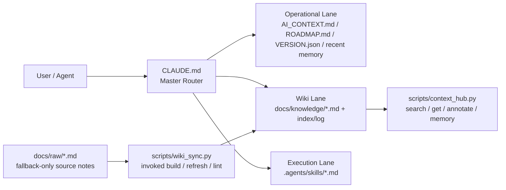

# 🍲 O-ALL-WANT (OAW) Framework

[English](README.en.md) | [中文](README.md)

> Why choose when you can have it all?
> 「小孩子才做選擇，身為一個開發者，我～全、都、要！」

<p align="center">
  
</p>

## 為什麼會在這?

這是一個專為「極度貪心」的 Agentic Coding 使用者量身打造的專案裝甲 (Harness)。

身為一個在不同 AI 平台間橫跳、追求 Tokenmaxxing 的「AI 渣男」，我最不能容忍的就是 Agent 的金魚腦。如果你也受夠了 Agent 動不動就失憶、瘋狂燃燒你昂貴的 Token，導致你還沒寫到核心功能就先看到那句令人崩潰的 `You have hit your limit`，那麼你大概也會想要這套裝甲。

本專案是我在數個下班後的夜晚，透過瘋狂奴役 Claude Code 與 Codex，把市面上幾個最火熱的 Harness Repo 與大神概念整合重構而成的結晶。我把 Self-improving、Context Hub、MemPalace、Karpathy Wiki、thin harness / fat skills 這些精華全部塞進來，目的只有一個：讓你的每一顆高級 Token 都花在真正重要的邏輯輸出，而不是浪費在「重跑已完成的內容」或「重新解釋專案架構」上。

我自己的用法其實很固定：只要有新的 agentic coding 專案要開，或某個目錄準備長期丟給 AI 協作，我就先拿 OAW 這套骨架幫它把 harness 架好。這樣就算中途因為額度、排隊、多人共用而被迫重開 session，新 agent 也能快速接手，不用每次從零重新講一次。

**只需要其中一樣?** 請直接 fork 對應的原作(列在最下面的 Source Lineage)；但如果你跟我一樣全都要，這鍋就是煮給你吃的。

## 🍲 內容大雜燴清單

- 🔄 **自我演進邏輯 (Self-improving)** — 用 `VERSION.json`、`ROADMAP.md`、`do_not_rerun` 讓 Agent 知道目前進度在哪，不要原地打轉或重跑已完成的內容；同時也整合了 `self-improving-agent` / ClawHub skill 那種「記錄錯誤、保留修正、持續學習」的 workflow 概念。
- 📉 **Token 優化器 (Context Hub + RTK-inspired output trimming)** — 讓 `CLAUDE.md` 當 router，只把當下需要的 lane 和檔案送進 context，再用 `context_hub.py` 補搜尋、annotate、memory 操作；而 `--compact` 則吸收了 RTK 那種「回來的東西也要壓短」的思路。靈感核心來自 Andrew Ng 的 Context Hub，加上 RTK 類型的 output-side token reduction 概念。
- ⚡ **thin harness / fat skills (Garry Tan)** — 把高頻流程丟進 `.agents/skills/*.md`，不要把所有 SOP 都塞回一份超肥 prompt。OAW 沿用這個方向，但再加上 lane routing。
- 🧠 **記憶宮殿 (Memory Palace)** — 讓 Agent 擁有跨 Session 的持久化記憶，解決「不同對話不能傳承」的斷片問題。OAW 用 `.agents/memory.md` 和 wrap-up discipline 承接這件事。
- 📚 **自動演進 LLM Wiki (Karpathy Concept)** — 奴役 AI 把開發碎筆記從 `docs/raw/` 慢慢編進 `docs/knowledge/`，讓 Agent 不只是會看筆記，而是會自己整理知識。

這個 repo 會持續更新；之後看到真的好用、而且能融進 OAW 的做法，我就會繼續往這鍋裡加料。

### 🤝 可選搭配：RTK (Rust Token Killer)

OAW 的 `--compact` 已把「輸出也要壓短」的概念融進來。若想要 Rust 原生的極致 token 壓縮，請直接看 [rtk-ai/rtk](https://github.com/rtk-ai/rtk)。

## 架構一頁看懂

先讓 `CLAUDE.md` 決定這次任務要走哪條 lane，再由 skills 和 scripts 接手重複工，這樣就不會一上來把整個 repo 全塞進 context。



## 快速上手

```bash
# 既有專案：直接進你的 repo
cd /path/to/your/project

# 全新專案：先 init
# mkdir my-project && cd my-project && git init

git clone https://github.com/lihowfun/O-ALL-WANT.git .agent-framework
bash .agent-framework/install.sh
```

裝完對 agent 講(直接複製)：

> 先讀 `CLAUDE.md`，再讀 `AI_CONTEXT.md`。
> 對照架構，把這個專案的真實狀況填進來，然後告訴我哪些重複流程可以收進 `.agents/skills/`。

### 🔌 不同 Agent / IDE 的對應方式

Router 永遠叫 `CLAUDE.md`，但不同 agent 預設讀不同的規則檔：

| Agent / IDE | 預設讀取 | OAW 對應方式 |
|-------------|---------|-------------|
| **Claude Code** | `CLAUDE.md` | ✅ 安裝後直接對應 |
| **GitHub Copilot** | `.github/copilot-instructions.md` | ✅ 安裝時自動建立，指向 `CLAUDE.md` |
| **OpenAI Codex** | `AGENTS.md` | 建一行 pointer：`Read CLAUDE.md for project rules.` |
| **Cursor** | `.cursorrules` | 同上 |
| **Windsurf** | `.windsurfrules` | 同上 |
| **Gemini** | `GEMINI.md` | 同上 |

嫌麻煩也可以直接跟 agent 說「先讀 CLAUDE.md」，效果一樣。

## 🧭 你講人話，Agent 做事

核心原則很簡單：你主要只要跟 agent 講話。前提是它會讀 `CLAUDE.md`，並遵守 Skills-First Principle。

| 你跟 Agent 說... | Agent 通常會做... |
|-----------------|------------------|
| 「我剛決定改用 Redis 當 cache」 | 寫入 `.agents/memory.md` → `[DECISION] 改用 Redis` |
| 「這個 bug 是 N+1 query 造成的」 | 寫入 memory；累積多條時主動提議提煉到 wiki |
| 「幫我整理一下 `docs/raw/` 的筆記」 | 比對到 `/wiki-refresh` skill → `wiki_sync.py refresh` → 產 knowledge 頁 |
| 「跑一下 benchmark」 | 比對到 `/benchmark` skill → 讀 baselines → 執行 → 產報告 |
| 「準備 release v1.2.0」 | 比對到 `/version-release` skill → 完整 checklist |
| 「這東西壞了，幫我 debug」 | 比對到 `/debug-pipeline` skill → 逐層排查 → 記錄 root cause |
| 「目前專案什麼狀態?」 | `context_hub.py status` → 版本 + 最近決策 + 知識主題 |

細節請看：[Skill Guide](docs/Skill_Guide.md)。

### 想直接下指令（不透過 agent）？

如果你偏好手動跑工具，而不是讓 agent 自己調度，可以直接用這些指令：

| 指令 | 用途 |
|------|------|
| `python3 scripts/context_hub.py status` | 版本 + 近期決策 + 知識主題 |
| `python3 scripts/context_hub.py search "關鍵字"` | 搜尋知識庫 |
| `python3 scripts/context_hub.py memory add "[TAG] 內容"` | 手動記到 memory |
| `python3 scripts/wiki_sync.py refresh topic_name` | 編譯某個 wiki 主題 |
| `python3 scripts/wiki_sync.py lint` | 檢查 metadata |
| `python3 scripts/wiki_sync.py lint --strict` | 另外抓未填的 `${...}` / `YYYY-MM-DD` |

完整列表：[CLI Reference](docs/CLI_Reference.md)。

## 🐕 Self-Hosting：repo 自己是自己的第一個用戶

Root 的 `CLAUDE.md` / `AI_CONTEXT.md` 等是 **OAW 團隊自用**的版本，不是給你的 template。你的 template 住在 `templates/`，`install.sh` 會幫你裝進專案。

**Public memory policy**：`.agents/memory.md` 已 gitignore(memory 是本地日記)。公開分享的是提煉後的 `docs/knowledge/`(教科書)。

## Source Lineage (站在巨人肩膀上)

以下是 OAW 的靈感與參考來源。有些有深入研究原始碼，有些只是概念層面的啟發：

**原始碼參考（有實際研究實作）**

- 🔄 **[self-improving-agent / ClawHub skill pattern](https://clawhub.ai/skills/self-improver)** — 用 version / roadmap / do_not_rerun 管理 agent 進度，並吸收「錯誤留痕、修正記錄、持續學習」的 workflow 概念，避免原地打轉
- 📉 **[andrewyng/context-hub](https://github.com/andrewyng/context-hub)** (MIT) — `context_hub.py` 的核心架構直接參考此 repo，searchable knowledge + annotate + routing
- 🧠 **[Memory Palace / MemPalace](https://github.com/MemPalace/mempalace)** (MIT) — `.agents/memory.md` 的結構與 wrap-up discipline 來自此 repo
- 📚 **[Karpathy-style LLM Wiki](https://gist.github.com/karpathy/442a6bf555914893e9891c11519de94f)** — `wiki_sync.py` 的 raw→knowledge 編譯邏輯直接實作了此 gist 的分離哲學

**概念靈感（文章／推文啟發，非原始碼）**

- ⚡ **[thin harness / fat skills (Garry Tan)](https://x.com/garrytan/status/2042925773300908103)** — 推文概念：把高頻操作收進 skill，讓 router 保持精簡
- 🤝 **[RTK (rtk-ai/rtk)](https://github.com/rtk-ai/rtk)** — output-side token reduction 的概念參考；OAW 沒有內建 RTK，但 `--compact` 吸收了「回傳內容也要壓短」這個思路

這份來源清單也會持續更新；之後如果遇到真的好用、而且能自然融進 OAW 的做法，也會補進來。

深入閱讀：[Architecture Origins](docs/Architecture_Origins.md) · [Design Principles](docs/Design_Principles.md)

## Examples + Docs

- 範例：[example/](example/)（從 `minimal-project/` 開始）
- [CLI Reference](docs/CLI_Reference.md) · [Skill Guide](docs/Skill_Guide.md) · [Wiki Sync Guide](docs/Wiki_Sync_Guide.md)
- [CONTRIBUTING.md](CONTRIBUTING.md) · [CHANGELOG.md](CHANGELOG.md)

## License

MIT
