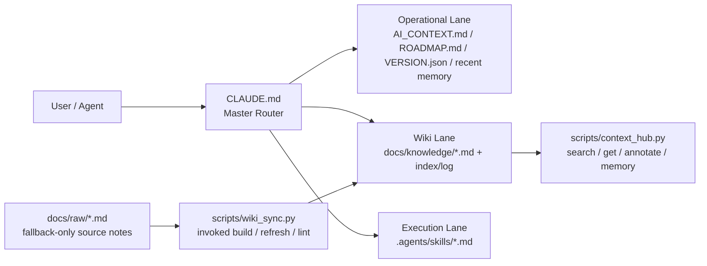

# 🍲 O-ALL-WANT (OAW) Framework

<div align="center">
  <a href="README.md">English</a> |
  <a href="README.zh.md">中文</a> |
  <a href="https://www.readme-i18n.com/lihowfun/O-ALL-WANT?lang=ja">日本語</a> |
  <a href="https://www.readme-i18n.com/lihowfun/O-ALL-WANT?lang=ko">한국어</a> |
  <a href="https://www.readme-i18n.com/lihowfun/O-ALL-WANT?lang=de">Deutsch</a> |
  <a href="https://www.readme-i18n.com/lihowfun/O-ALL-WANT?lang=fr">Français</a> |
  <a href="https://www.readme-i18n.com/lihowfun/O-ALL-WANT?lang=es">Español</a>
</div>

> Why choose when you can have it all?
> 「小孩子才做選擇，身為一個開發者，我～全、都、要！」

<p align="center">
  
</p>

> **TL;DR** — OAW 把你 repo 裡的 `CLAUDE.md` 變成 agent router：lane 分流 context、持久 memory、自動編譯 wiki，讓 AI coding session **可以接續，不用從零重啟**。
>
> **寫給**在 Claude Code / Codex / Copilot / Cursor 之間橫跳、不想每次被 rate limit、session reset、多代理人協作切走 context 的開發者。
>
> **3 步就上手**：`git clone` → `bash install.sh` → 丟一句話給 agent。完整 Quick Start [往下看](#-快速上手)。

## 為什麼會在這?

這是一套專為「極度貪心」的 agentic coding 使用者打造的專案裝甲（harness）。

如果你也是那種會在不同 AI 平台間橫跳、腦中只想著怎麼把每一顆高級 token 榨到最大的開發者，那你大概很熟悉這種心碎：對話一長，agent 開始失憶；session 一換，對專案的掌握度瞬間歸零。你還沒寫到真正重要的邏輯，就先被迫花一大堆 token 重新解釋背景，最後看到那句讓人崩潰的 `You have hit your limit`。

如果你也受夠了這種資源內耗，OAW 就是我替這件事做出來的解藥。

這專案是我在數個燃燒肝臟的下班夜晚，瘋狂奴役 Claude Code 與 Codex，然後把 self-improving、Context Hub、MemPalace、Karpathy-style LLM Wiki、thin harness / fat skills 這些大神github repo或文章精華全摻在一起煮的撒尿牛丸鍋。目的只有一個：**讓昂貴 token 用在真的值得的推理與輸出上**，而不是浪費在「重跑已完成的內容」或「重新解釋專案架構」上。

我自己的用法很固定：只要是新的 agentic coding 專案，或某個我準備長期交給 AI 協作的目錄，我就先把 OAW 裝上去。這樣就算中途因為額度、排隊、多代理人協作切換，甚至只是被迫換個 session，下一個 agent 也能快速接手，不用每次從零重新講一次。

> **只需要其中一樣?** 請直接 fork 對應的原作（列在最下面的 Source Lineage）。但如果你跟我一樣全都要，這鍋就是煮給你吃的。

---

## 🍲 內容大雜燴清單

### 🔄 自我演進邏輯 (Self-improving)

`VERSION.json` + `ROADMAP.md` + `do_not_rerun` 讓 Agent 知道進度在哪，不會原地打轉或重跑已完成的內容。整合 `self-improving-agent` / ClawHub skill 的「記錄錯誤、保留修正、持續學習」workflow。

### 📉 Token 優化器 — Context Hub + RTK-inspired output trimming

`CLAUDE.md` 當 router，只把當下需要的 lane 和檔案送進 context；`context_hub.py` 補搜尋、annotate、memory 操作。`--compact` 吸收「回傳內容也要壓短」的思路。

### ⚡ thin harness / fat skills (Garry Tan)

把高頻流程丟進 `.agents/skills/*.md`，不要塞進一份超肥 prompt。OAW 沿用這個方向，再加上 lane routing。

### 🧠 記憶宮殿 (Memory Palace)

跨 Session 的持久化記憶，解決「不同對話不能傳承」的斷片問題。`.agents/memory.md` + wrap-up discipline 承接這件事。

### 📚 自動演進 LLM Wiki (Karpathy Concept)

把開發碎筆記從 `docs/raw/` 編進 `docs/knowledge/`。每次有重要結論，直接跟 agent 說 _「把這次的發現同步到 wiki」_，它就會跑 `wiki_sync.py refresh`，把 memory 和 raw 筆記蒸餾成結構化知識頁——不需要另外安排整理時間。

---

### 🤝 可選搭配：RTK (Rust Token Killer)

OAW 的 `--compact` 已把「輸出也要壓短」的概念融進來。若想要 Rust 原生的極致 token 壓縮，請直接看 [rtk-ai/rtk](https://github.com/rtk-ai/rtk)。

---

## 🏗️ 架構設計

OAW 的核心是 **Context Routing**：`CLAUDE.md` 作為 Master Router，依當下任務動態決定要載入哪條 lane；skills 和 scripts 接手執行層的重複動作。每個 session 只注入**當下真正需要**的 context，而不是把整個 repo 塞給 LLM 慢慢翻。



---

### 🛡️ 駕馭工程（Harness Engineering）三大支柱

每一條都綁在具體檔案或腳本上，也各自對應一個會真的壞掉的 LLM 失敗模式：

| 設計原則 | 實作方式 | 解決的問題 |
|---------|---------|-----------|
| **[Context Fragmentation](docs/knowledge/Harness_Engineering_Context_Fragmentation.md)**<br/>上下文分流 | Lane 動態路由，按任務類型只載入相關檔案 | 避免 LLM 在長代碼中出現 **Lost in the Middle** 現象 |
| **[Deterministic State Control](docs/knowledge/Harness_Engineering_Deterministic_State.md)**<br/>確定性狀態控制 | `VERSION.json` + `do_not_rerun` 構成開發狀態機 | 防止 Agent 在自主修復時重跑已完成任務或陷入無限循環 |
| **[Knowledge Synthesis](docs/knowledge/Harness_Engineering_Knowledge_Synthesis.md)**<br/>知識蒸餾 | `memory.md`（短期決策）→ `knowledge/`（長期知識）的自動編譯 pipeline | 把 Agentic Workflow 產生的碎片洞察沉澱為可重用資產 |

---

## 🔁 新 Session 時，差在哪

| 新 session 打開，agent 的狀態… | 沒有 OAW | 有 OAW |
|---|---|---|
| 知道這個 repo 在幹嘛 | ❌ 你自己貼架構、目標、技術棧 | ✅ 讀 `CLAUDE.md` + `AI_CONTEXT.md` baseline |
| 知道最近做過什麼決策 | ❌ 你從記憶裡口述 | ✅ `.agents/memory.md` 最後 5 筆，按需載入 |
| 知道哪些流程是可重複 SOP | ❌ 每次重講一次 | ✅ `.agents/skills/` 靠 intent 關鍵字觸發 |
| 不會重跑已完成的工作 | ❌ 自主修復容易跑進迴圈 | ✅ `VERSION.json` `do_not_rerun` 強制 |

> **實測數據**：lane routing 只載當下任務用到的檔案——每條 lane ~3k tokens vs 全載 ~22.6k tokens，[**節省 86–87%**](docs/knowledge/OAW_Session_Continuity_Test.md)（出自 session 連續性測試）。Baseline（`CLAUDE.md` + `AI_CONTEXT.md`，約 2.3k tokens）永遠載入；lane 專屬檔再加 ~400–800 tokens。

---

## ⚡ 快速上手

### 🆕 全新專案

```bash
mkdir my-project && cd my-project && git init
git clone https://github.com/lihowfun/O-ALL-WANT.git OAW
bash OAW/install.sh
```

裝完對 agent 說：

> 先讀 `CLAUDE.md`，再讀 `AI_CONTEXT.md`。
> 我要做的是 ${在這裡陳述你的專案目的}。根據架構幫我把 `AI_CONTEXT.md` 骨架填好，再建議哪些重複流程可以收進 `.agents/skills/`。

### 📂 既有專案

若你已經有自己的 `CLAUDE.md` / `AI_CONTEXT.md`，`install.sh` 會**先列出所有要寫入的 managed file**，等你按 `y/N` 確認才覆蓋——不會靜默蓋掉任何東西。想先看 OAW 長什麼樣再決定，可以先逛 [`example/minimal-project/`](example/minimal-project/) 或 `OAW/templates/`。

```bash
cd /path/to/your/project
git clone https://github.com/lihowfun/O-ALL-WANT.git OAW
bash OAW/install.sh     # 跳「Overwrite?」時會列出每個衝突檔，按 N 可中止
```

裝完對 agent 說：

> 先讀 `CLAUDE.md`，再讀 `AI_CONTEXT.md`。
> 對照架構，把這個專案的真實狀況填進來，然後告訴我哪些重複流程可以收進 `.agents/skills/`。

### 🔌 不同 Agent / IDE 的對應方式

**主力測試對象**：Claude Code 與 OpenAI Codex（OAW 本身就是每天用它們開發的）。其他 agent 都有 adapter 可用，歡迎實戰回報。

Router 永遠叫 `CLAUDE.md`，但不同 agent 預設讀不同的規則檔：

| Agent / IDE | 預設讀取 | OAW 對應方式 |
|-------------|---------|-------------|
| **Claude Code** | `CLAUDE.md` | ✅ 安裝後直接對應 |
| **GitHub Copilot** | `.github/copilot-instructions.md` | ✅ 安裝時自動建立，指向 `CLAUDE.md` |
| **OpenAI Codex** | `AGENTS.md` | 建一行 pointer：`Read CLAUDE.md for project rules.` |
| **Cursor** | `.cursorrules` | 同上 |
| **Windsurf** | `.windsurfrules` | 同上 |
| **Gemini** | `GEMINI.md` | 同上 |

嫌麻煩也可以直接跟 agent 說「先讀 CLAUDE.md」，效果一樣。

---

## 💬 一句話調度 SOP

OAW 的操作哲學很簡單：**你只負責描述意圖，Agent 負責找到對應的 SOP 並執行**。

這背後的機制叫 **Skills-First Principle**——Agent 在回應前會先比對 `.agents/skills/`，有 match 就走預寫好的 workflow，沒 match 才臨場發揮。好處是：**可重現的流程不受 LLM 隨機性影響，一次性的問題保留創造空間**。

| 你說什麼 | Agent 觸發的 SOP |
|---------|-----------------|
| 「我剛決定改用 Redis 當 cache」 | 寫入 `.agents/memory.md` → `[DECISION] 改用 Redis` |
| 「這個 bug 是 N+1 query 造成的」 | 寫入 memory；累積多條時主動提議蒸餾到 wiki |
| 「幫我整理一下 `docs/raw/` 的筆記」 | 觸發 `/wiki-refresh` → `wiki_sync.py refresh` → 產出 knowledge 頁 |
| 「跑一下 benchmark」 | 觸發 `/benchmark` → 讀 baselines → 執行 → 產報告 |
| 「準備 release v1.2.0」 | 觸發 `/version-release` → 跑完整 checklist |
| 「這東西壞了，幫我 debug」 | 觸發 `/debug-pipeline` → 逐層排查 → 記錄 root cause |
| 「目前專案什麼狀態?」 | `context_hub.py status` → 版本 + 最近決策 + 知識主題 |

細節請看：[Skill Guide](docs/Skill_Guide.md)。

---

### 🔧 想直接下指令（Bypass Agent）

偏好手動調度而不透過 agent 的話，這些是直通底層的 CLI：

| 指令 | 用途 |
|------|------|
| `python3 scripts/context_hub.py status` | 版本 + 近期決策 + 知識主題 |
| `python3 scripts/context_hub.py setup` | 掃描還沒填完的 `${...}` placeholder（裝完第一件該跑的事）|
| `python3 scripts/context_hub.py search "關鍵字"` | 搜尋知識庫 |
| `python3 scripts/context_hub.py search "關鍵字" --include-memory` | 搜尋時把 `memory.md` 一起拉進來 |
| `python3 scripts/context_hub.py context --lane [operational\|wiki\|execution\|debug]` | 列出某條 lane 底下的檔案 |
| `python3 scripts/context_hub.py memory add "[TAG] 內容"` | 手動記到 memory |
| `python3 scripts/wiki_sync.py refresh topic_name` | 編譯某個 wiki 主題 |
| `python3 scripts/wiki_sync.py lint` | 檢查 metadata |
| `python3 scripts/wiki_sync.py lint --strict` | 另外抓未填的 `${...}` / `YYYY-MM-DD` |

完整列表：[CLI Reference](docs/CLI_Reference.md)。

---

## 🐕 Self-Hosting：repo 自己是自己的第一個用戶

Root 的 `CLAUDE.md` / `AI_CONTEXT.md` 等是 **OAW 團隊自用**的版本，不是給你的 template。你的 template 住在 `templates/`，`install.sh` 會幫你裝進專案。

**Public memory policy**：`.agents/memory.md` 已 gitignore(memory 是本地日記)。公開分享的是提煉後的 `docs/knowledge/`(教科書)。

---

## Source Lineage (站在巨人肩膀上)

以下是 OAW 的靈感與參考來源。有些有深入研究原始碼，有些只是概念層面的啟發：

**原始碼參考（有實際研究實作）**

- 🔄 **[self-improving-agent / ClawHub skill pattern](https://clawhub.ai/skills/self-improver)** — 用 version / roadmap / do_not_rerun 管理 agent 進度，並吸收「錯誤留痕、修正記錄、持續學習」的 workflow 概念，避免原地打轉
- 📉 **[andrewyng/context-hub](https://github.com/andrewyng/context-hub)** (MIT) — `context_hub.py` 的核心架構直接參考此 repo，searchable knowledge + annotate + routing
- 🧠 **[Memory Palace / MemPalace](https://github.com/MemPalace/mempalace)** (MIT) — `.agents/memory.md` 的結構與 wrap-up discipline 來自此 repo

**概念靈感（文章／推文啟發，非原始碼）**

- 📚 **[Karpathy-style LLM Wiki](https://gist.github.com/karpathy/442a6bf555914893e9891c11519de94f)** — 隨手筆記 vs 編譯後 wiki 的分離哲學，啟發了 `docs/raw/` → `docs/knowledge/` 的架構
- ⚡ **[thin harness / fat skills (Garry Tan)](https://x.com/garrytan/status/2042925773300908103)** — 推文概念：把高頻操作收進 skill，讓 router 保持精簡
- 🤝 **[RTK (rtk-ai/rtk)](https://github.com/rtk-ai/rtk)** — output-side token reduction 的概念參考；OAW 沒有內建 RTK，但 `--compact` 吸收了「回傳內容也要壓短」這個思路

這份來源清單也會持續更新；之後如果遇到真的好用、而且能自然融進 OAW 的做法，也會補進來。

深入閱讀：[Architecture Origins](docs/Architecture_Origins.md) · [Design Principles](docs/Design_Principles.md)

## Examples + Docs

- 範例：[example/](example/)（從 `minimal-project/` 開始）
- [CLI Reference](docs/CLI_Reference.md) · [Skill Guide](docs/Skill_Guide.md) · [Wiki Sync Guide](docs/Wiki_Sync_Guide.md)
- [CONTRIBUTING.md](CONTRIBUTING.md) · [CHANGELOG.md](CHANGELOG.md)

## License

MIT
